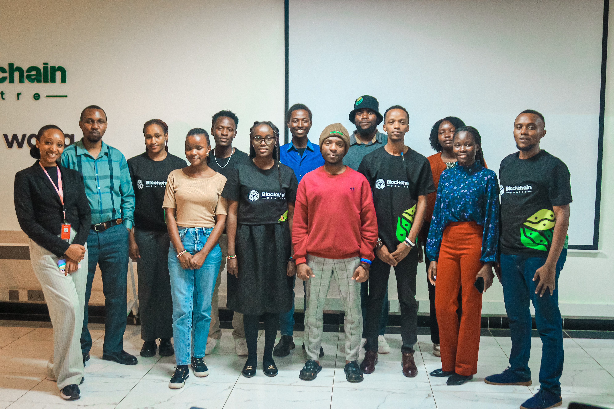
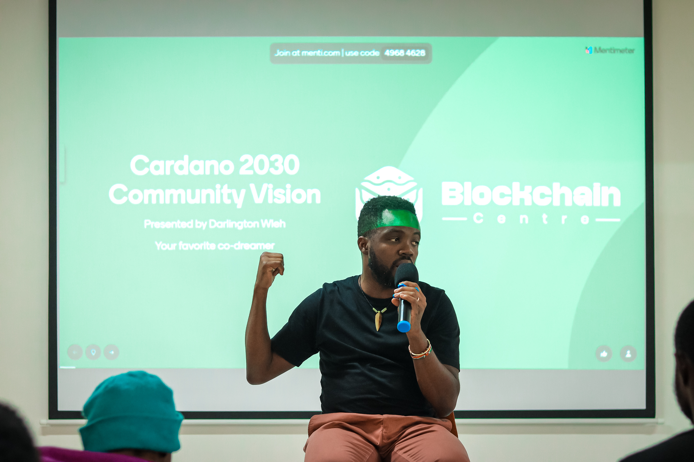

### Event Report: Cardano Community Meetup – Nairobi

**Event:** Cardano Community Meetup  
**Location:** Blockchain Centre NBO, Nairobi  
**Date:** 6/11/2025  
**Format:** In-person community workshop  
**Attendance:** 100+ participants  
**Event Link:** https://www.blockchaincentrenbo.com/events/cardano-community-meetup/

#### Objective
The primary objective of this event was to introduce Cardano to the Nairobi developer and blockchain community, and to launch a recurring series of workshops aimed at onboarding and educating both new and existing developers within the Cardano ecosystem.

#### Event Summary
The Cardano Community Meetup was successfully held at Blockchain Centre NBO and marked the first session in an ongoing community engagement initiative. The event brought together developers, blockchain enthusiasts, and newcomers interested in decentralized technologies and governance.

A featured session was delivered by **Haron Mwangi (Developer Advocate)**, focusing on **Bitcoin and Cardano governance models**. The session highlighted Cardano’s community-driven governance structure, with particular emphasis on its on-chain treasury model that enables sustainable, community-funded development, in contrast to Bitcoin’s reliance on external donors.

**Attendees**

#### Key Activities
- Introduction to Cardano and its ecosystem  
- Live wallet creation for first-time users  
- Interactive scavenger hunt with ADA rewards  
- Open discussions on decentralized governance  
- Networking and community building  

#### Outcomes & Benefits
- **Increased ecosystem awareness:** Over 100 attendees were introduced to Cardano’s governance model, tooling, and community structure.
- **Developer onboarding:** Several participants created their first Cardano wallets, lowering the barrier to future participation.
- **Community formation:** The event established an initial base for a consistent Cardano community presence in Nairobi.
- **Engagement validation:** Strong turnout and active participation demonstrated clear local interest in Cardano-focused education and workshops.
- **Foundation for future programs:** The meetup provided a practical blueprint for recurring workshops, developer onboarding sessions, and deeper technical events.
