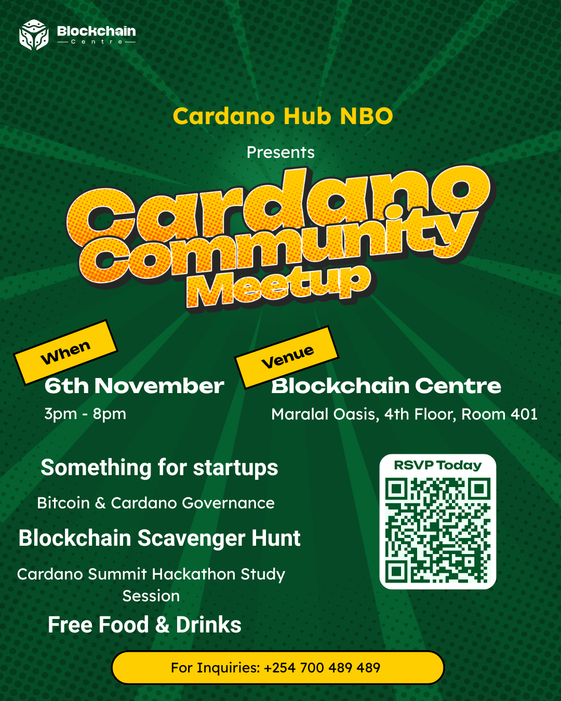
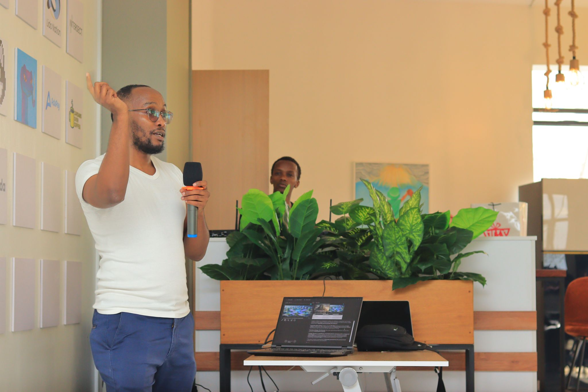
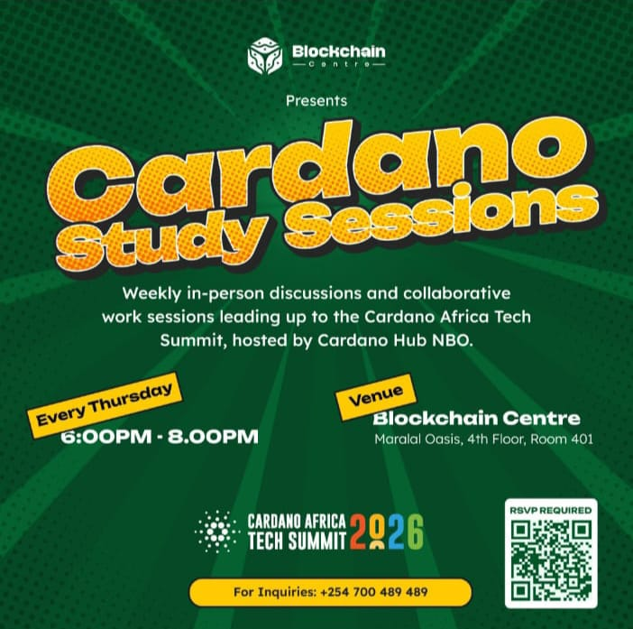
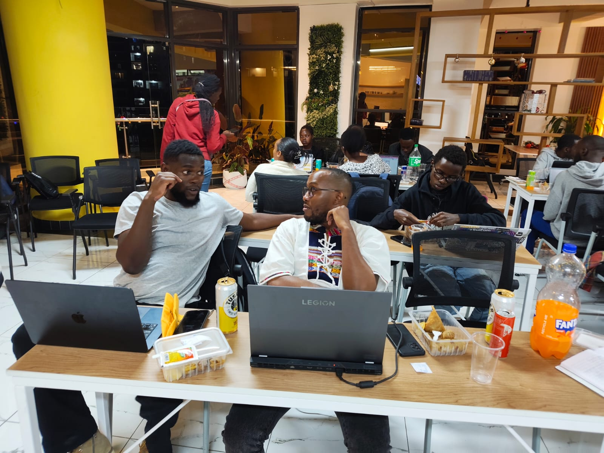
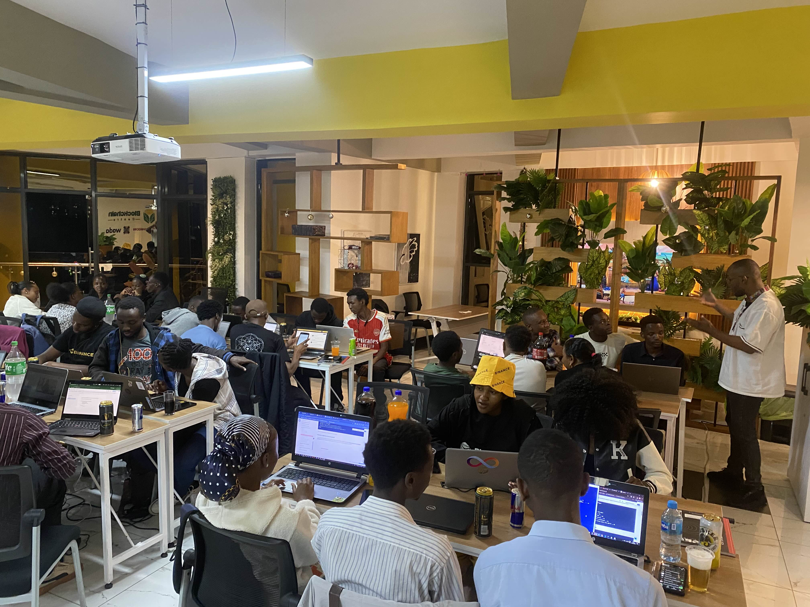
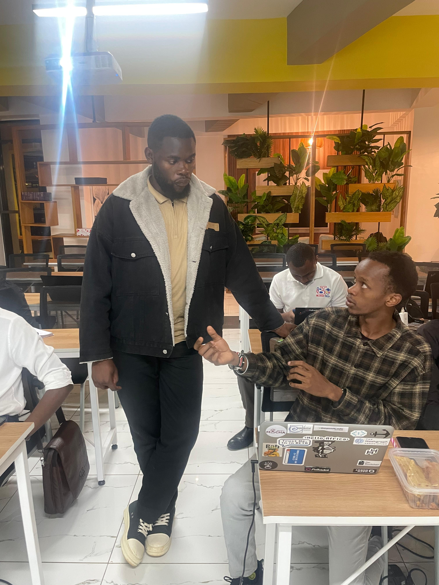

# Q4 2025: Community Engagement

**By Harun Mwangi**

This quarter has been about showing up, connecting, and educating. From explaining governance to a room full of curious devs to introducing blockchain, Cardano, and Intersect to whoever would listen, I’ve been focused on making sure Cardano isn’t just a buzzword, but a solution people actually want to use.

Here’s a look at what I’ve been up to.

---

### The Blockchain Center Nairobi

The Blockchain Center remains our ecosystem's home base. This quarter, I focused on deep-diving into governance and active mentorship.

#### Cardano Community Meetup (November 6, 2025)

I delivered a talk on **"Blockchain Governance: Bitcoin vs. Cardano"** to over 100 attendees. We explored the main differences between Bitcoin's governance structure and Cardano's decentralized approach (Voltaire). The engagement showed a clear hunger for participation.

`Harun: Talk on Governance`

#### Cardano Study Sessions (Dec 4, 2025 / Every Other Thursday)

Beyond the talks, I’ve made it a priority to attend our bi-weekly Thursday study sessions as a mentor whereas Emanuel attends every Thursday. These are critical for helping developers prepare for the 

`Emmanuel: left, Harun:right`

`Harun: Mentorship at Study Session`

**Cardano Africa Tech Summit (CATS) Hackathon**.
*   **Impact:** Consistent mentorship ensures our builders are supported effectively as we approach the summit.

`Emmanuel: mentorship at Study Session`

---

### English Contributors Workshop

I attended Dan’s **English Contributors Workshop** to support the onboarding of new contributors.
*   **My Role:** I gave an introduction to Cardano and provided general support where required, helping attendees understand how their code fits into the Intersect MBO.

---

### Latitude59 Kenya (Dec 3/4/5/2025)

**Latitude59 Kenya** offered a chance to bridge Africa’s startup scene with Web3.

#### Connecting with Creatives
I interacted with the team at **Village Creative**, learning about the education programs they are building for Kenyan creators.
*   **Outcome:** Impressed by the potential overlap with Web3, they invited me to give a talk on **NFTs** when their program officially kicks off in **2026**.

#### Networking: Gaming & The Election Systems
On the last day, I met a developer interested in building gaming companies around NFTs for leaderboard scoring.

I also connected with the developer who is building a transparent election system for Kenya. He expressed a strong interest in building on Cardano, so I invited him to join our weekly CATS Hackathon study sessions—he has since cleared his schedule to attend!

#### A Curious Mention: The Winners
It was massive validation to see Web3 and Creator-tech solutions dominate the awards:
*   **Winner:** **Mediakits.io**, a platform for influencers to create real-time media kits. They won a trip to **Latitude59 Tallinn 2026** and a booth to showcase their product globally.
*   **Runner-up:** **Payd**, a tool for borderless freelance payments. They secured a **$50,000 investment** from the Nairobi Business Angel Network and an additional **$50,000 prize**.

Seeing real-world utility recognized at this level reinforces that we are on the right path.

---