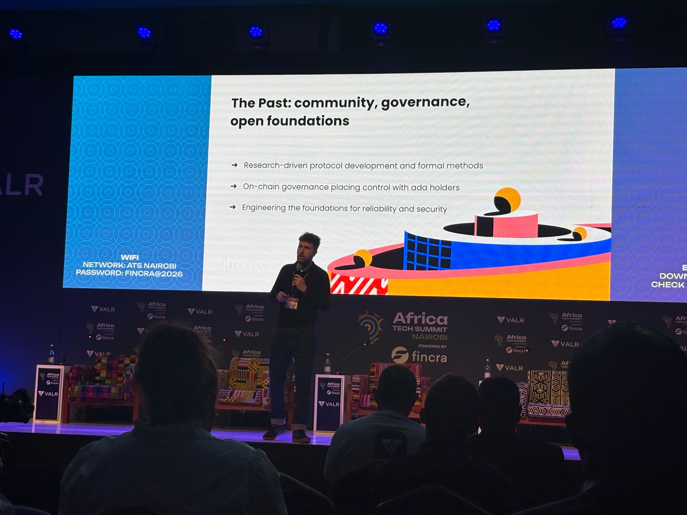

# IRL Event Report

## Cardano Africa Tech Summit (CATS) 2026
   
Dates: February 11–13, 2026
Location: Nairobi, Kenya
Website: https://cats.wada.org

### Overview
The Cardano Africa Tech Summit (CATS) 2026 brought together developers, builders, and community leaders from across Africa who are actively building within the Cardano ecosystem. The event focused on developer education, ecosystem collaboration, governance awareness, and accelerating blockchain adoption across the continent.

### Role and Participation
During the summit, I actively engaged with developers, students, and ecosystem contributors throughout the event. My participation centered on three key areas: onboarding, mentorship, and ecosystem awareness.

First, I onboarded new participants into the Cardano ecosystem by introducing them to available developer resources, governance structures, and opportunities to contribute. Many attendees were either new to Cardano or exploring ways to transition from general Web3 development into the Cardano ecosystem. I helped guide these individuals by explaining available tooling, developer pathways, and the role that community participation plays in governance.

Second, I mentored attendees who were interested in building on Cardano or contributing to ecosystem initiatives. These conversations included guidance on development resources, participation in governance processes, and understanding how developers and community contributors can collaborate through initiatives supported by Intersect.

Third, I helped raise awareness around Intersect’s mission and its role in supporting the Cardano ecosystem through open-source collaboration, governance participation, and community-led initiatives. This helped connect developers and builders with the broader ecosystem infrastructure that supports Cardano’s long-term sustainability.

### Impact
The event provided a strong platform to interact with developers across Africa who are actively building or planning to build within the Cardano ecosystem. Through direct conversations, mentorship, and onboarding support, I was able to help lower barriers to entry for new contributors while strengthening relationships within the regional developer community.

## Africa Tech Summit Nairobi 2026

Dates: February 12–13, 2026
Location: Nairobi, Kenya
Website: https://www.africatechsummit.com/nairobi/

### Overview
Africa Tech Summit Nairobi is one of the leading pan-African technology conferences, bringing together startups, investors, developers, and ecosystem builders across sectors such as fintech, blockchain, AI, and digital infrastructure. The event serves as a hub for networking, partnerships, and knowledge sharing across Africa’s rapidly growing technology ecosystem.

### Role and Participation
While attending the summit, I focused on engaging with the broader Web3 and blockchain community beyond the immediate Cardano ecosystem. This created opportunities to introduce developers, founders, and technology leaders to Cardano’s infrastructure and governance model.

Throughout the event, I participated in discussions with developers and startup founders who were exploring blockchain adoption in areas such as fintech, digital identity, and decentralized infrastructure. In these interactions, I shared insights about Cardano’s technical capabilities, governance model, and the opportunities available for builders within the ecosystem.

I also connected with individuals who were interested in learning more about decentralized governance and open-source collaboration. These conversations provided an opportunity to explain the role of Intersect and how community-driven governance helps support the long-term development of the Cardano ecosystem.

Additionally, I supported informal mentoring discussions with developers who were exploring Web3 development pathways. These interactions helped provide guidance on how developers can engage with the Cardano ecosystem, access learning resources, and potentially contribute to ecosystem initiatives.

### Impact
Attending Africa Tech Summit expanded outreach beyond the existing Cardano community and allowed me to engage with a broader group of developers, entrepreneurs, and innovators across the African technology ecosystem. These conversations helped introduce new participants to Cardano and Intersect while strengthening awareness of governance participation and open-source collaboration.

## Picture highlights from the event

## Conclusion
By attending and actively engaging at both Cardano Africa Tech Summit 2026 and Africa Tech Summit Nairobi 2026, I fulfilled the quarterly milestone of participating in at least two Web3 events. Through onboarding, mentorship, ecosystem outreach, and developer engagement, I contributed to strengthening community participation and advancing Intersect’s mission of supporting open-source collaboration and ecosystem growth.
