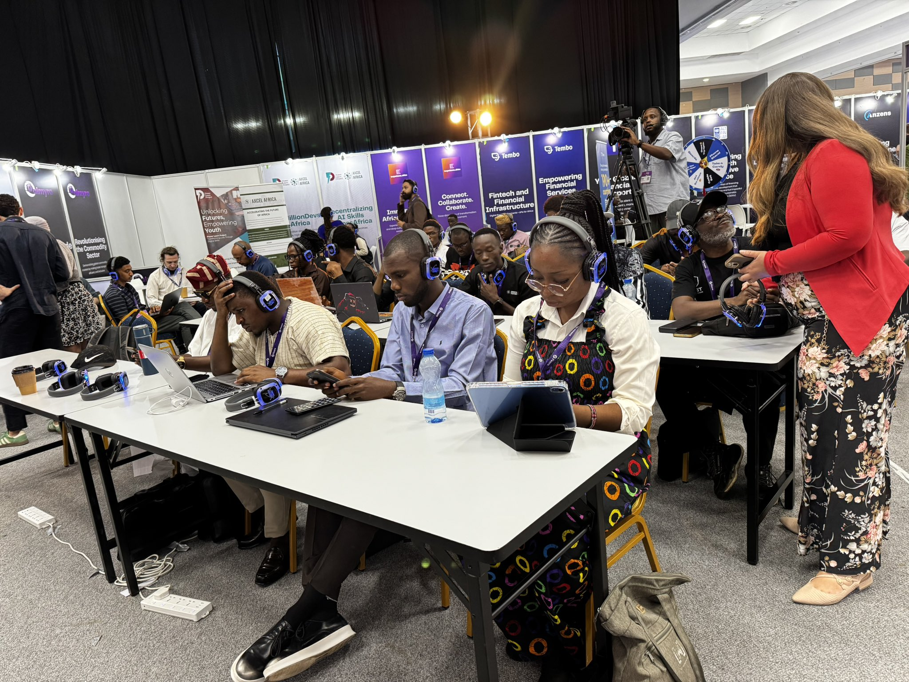
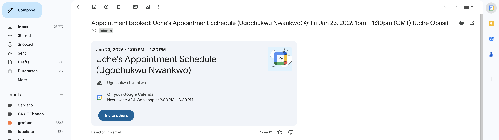

During Q1 2026, I contributed to the onboarding of new developers into the Cardano ecosystem by actively engaging with community members and introducing them to opportunities within Intersect’s developer-focused initiatives.

As part of this effort, I formally onboarded two new developers, Ugochukwu and Ifedili, through dedicated onboarding sessions conducted via Google Meet. During these sessions, I introduced them to the structure and purpose of Intersect, including the roles of the Open Source Office (OSO), the Open Source Committee (OSC), and the Developer Experience (DevEx) working group. I also provided guidance on how developers can participate in technical discussions, contribute to open-source initiatives, and engage with working groups that support the ongoing development of Cardano. You can find the meeting report [here](https://docs.google.com/spreadsheets/d/1f5g25cjjNIrLzXlAfWj_szMx6kL1C7AzRPm48tyNtzI/edit?usp=sharing)

In addition to these direct onboarding sessions, I expanded outreach through in-person engagement at two major technology events during the quarter: the Cardano Africa Tech Summit (CATS) 2026 and Africa Tech Summit Nairobi 2026. These events created opportunities to connect with developers, founders, and technology enthusiasts who were exploring blockchain development or seeking to deepen their involvement in Web3.

Through conversations and informal mentoring at these events, I introduced several attendees to the Cardano ecosystem, highlighted available developer resources, and encouraged participation in technical working groups and community initiatives supported by Intersect. These interactions served as an important entry point for developers who were either new to Cardano or evaluating different blockchain ecosystems to build on.

By combining direct onboarding meetings with ecosystem outreach at developer-focused events, I was able to meet the quarterly milestone of onboarding at least two new developers while also expanding awareness of Cardano’s development ecosystem among a broader audience.

