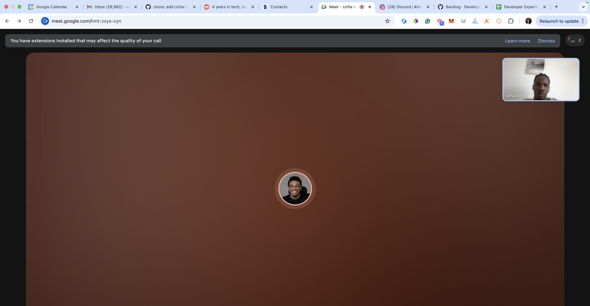
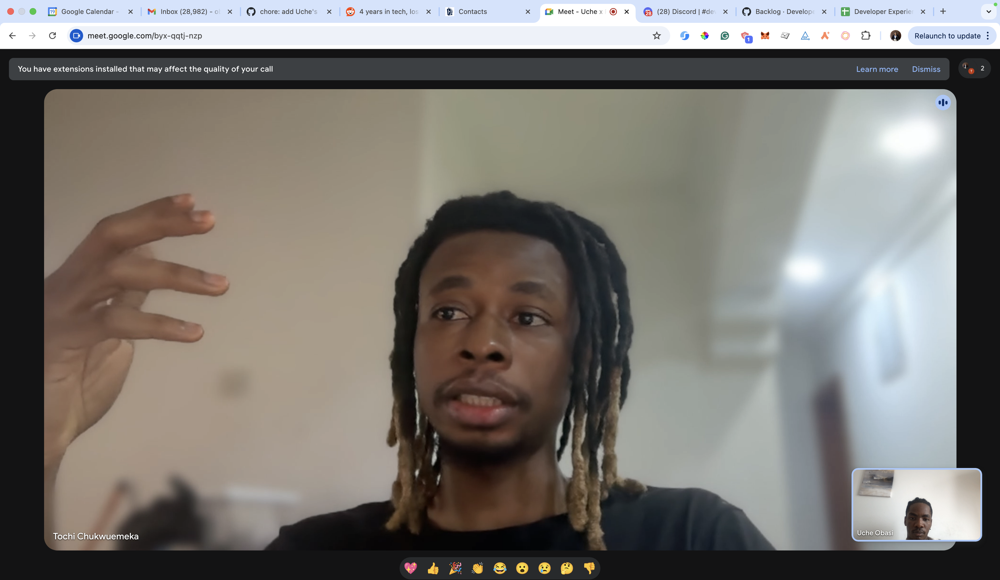
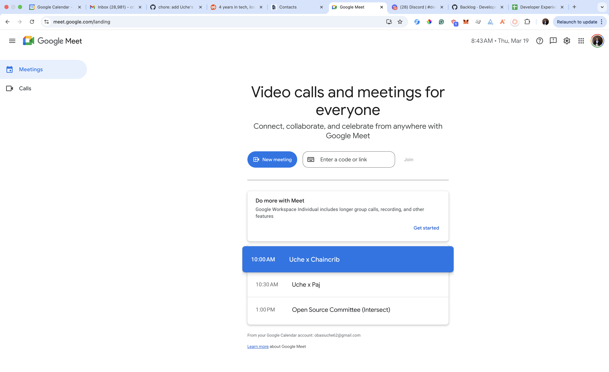

# Strategic Collaboration Report – Q1 2026

### Overview
During Q1 2026, I contributed to deepening strategic collaborations within the Cardano ecosystem by facilitating introductory conversations with external projects and ecosystem participants.

### Chaincrib

As part of this effort, I held an introductory meeting with folks from [Chaincrib](https://www.chaincrib.com/), an existing Cardano-based project and [Project Catalyst participant](https://projectcatalyst.io/funds/13/cardano-use-cases-concept/chaincrib-or-tokenizing-rwa-real-estate-properties-on-cardano). This discussion focused on strengthening alignment with the broader ecosystem, exploring potential areas of collaboration, and identifying opportunities for deeper engagement with Intersect initiatives and community-driven development efforts.

### Paj

In addition, I facilitated an introductory call with folks from [Paj](https://paj.cash), a project currently operating within the Solana ecosystem but actively exploring expansion into Cardano. During this conversation, I introduced the Cardano ecosystem, including its governance model, developer resources, and the role of Intersect in supporting open-source collaboration. I also provided guidance on how Paj could begin evaluating integration pathways and engaging with the Cardano community.

### Summary

These engagements served to both reinforce relationships within the existing Cardano ecosystem and create a pathway for new projects to onboard and potentially build within it. In particular, the discussion with Paj represents a strategic opportunity to attract external innovation into Cardano, supporting ecosystem growth and cross-chain collaboration.

