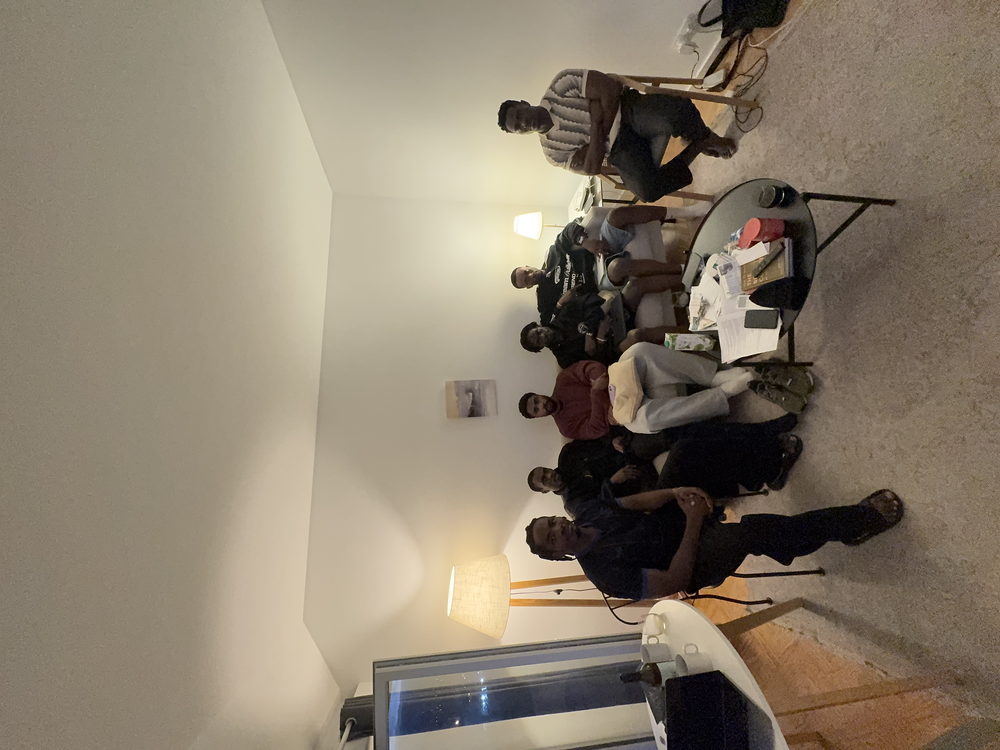

# IRL Event Report

## Developer Advocates OSS Satelite Event

Dates: May 19, 2026
Location: Lisbon, Portugal

### Overview

Organized a satellite event in Lisbon with 5 attendees, bringing together local Cardano enthusiasts and connecting them with community members worldwide via an online bridge to witness the Open Source Summit event.

### Role and participation

- Organized and facilitated the in-person gathering in Lisbon
- Coordinated online participation so attendees could join the broader global community during the Open Source Summit
- Conducted technical workshops to upskill participants on Cardano development

### Impact

- 5 in-person attendees engaged in the event
- 4 developers successfully onboarded into the Cardano ecosystem
- Strengthened the connection between local and global Cardano communities
- Delivered hands-on technical workshops that provided practical development experience

### Conclusion

This milestone was completed successfully. The satellite event achieved its goal of building a global community by bridging local Cardano enthusiasts in Lisbon with the wider open-source ecosystem through a hybrid format, while also contributing to developer onboarding through technical workshops.
