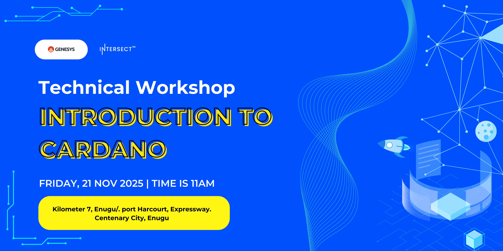
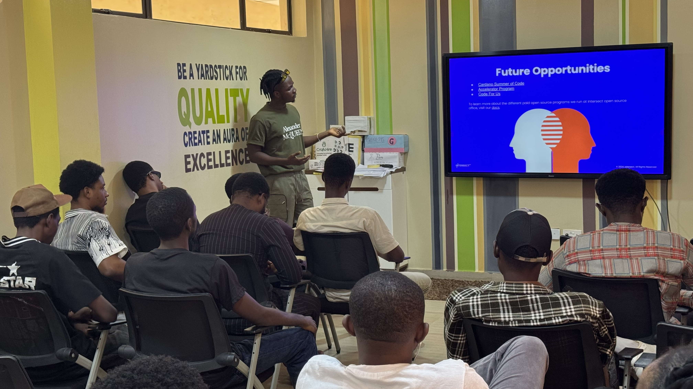
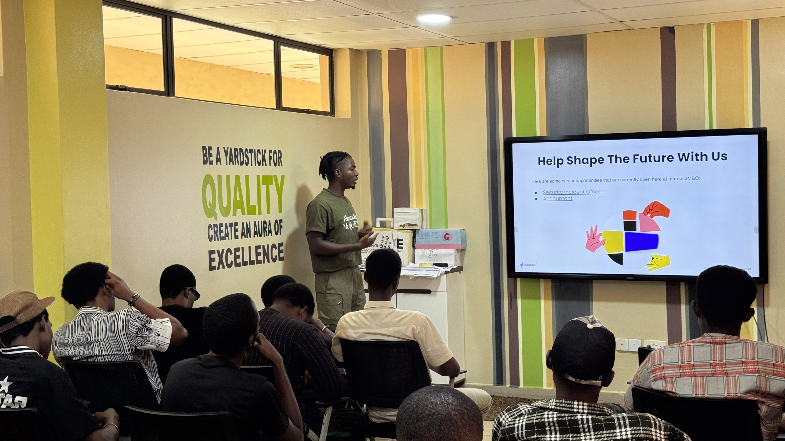
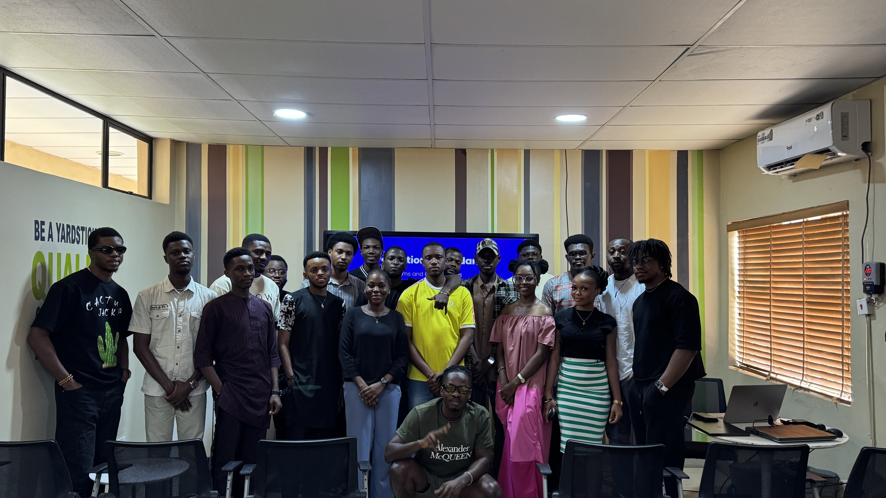

`# Introduction to Cardano Physical Meetup, Enugu

The Introduction to Cardano IRL/Community event was successfully held in Enugu, Nigeria bringing together blockchain enthusiasts, students, developers, and professionals interested in learning about the Cardano ecosystem. The session aimed to introduce the fundamentals of Cardano, its unique architecture, real-world applications, and opportunities within the ecosystem. The event had a total of over 25 attendees. The event helped raise awareness about Cardano in the South-East region and motivated several attendees to explore further learning paths, developer tools, and community involvement.

## Picture highlights from the event

