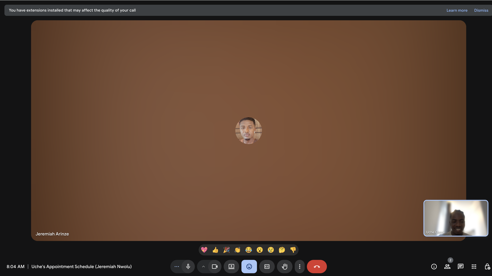

I successfully met the acceptance criteria for this task by maintaining a consistent meeting cadence for the Developer Experience Working Group and making myself available for onboarding and one-on-one conversations across multiple communication channels.

In line with expectations, I kept an accurate record of meetings and interactions like calls, and direct outreach through Discord. Beyond regular DA check-ins, OSC meetings, and working group sessions, I ensured that new developers had dedicated opportunities for support and engagement.

During the quarter, I completed the required onboarding conversations with new developers:

Jerry – He reached out through my public calendar for a one-on-one call. During our conversation, I introduced him to Intersect, outlined available opportunities, and guided him through the community onboarding process. This resulted in him successfully joining the Intersect Discord community.

Dev Ex Working Group Sessions - By consistently leading the Developer Experience Working Group sessions, I successfully fulfilled the meeting milestone for this period. I established and maintained the group’s cadence, facilitated productive discussions, and ensured regular participation and progress tracking. My leadership in these sessions demonstrates full completion of the meeting-related acceptance criteria.

[Check out one of my dev ex working group session](https://youtu.be/xv_XXMt205s?si=klD48Kzl7PN0OeWf)

Enugu (Nigeria) In-Person Event – At my in-person developer event in Enugu, I engaged directly with several new attendees who expressed interest in participating in Intersect. I provided guidance on the onboarding process, answered questions about OSO/OSC/Cardano, and supported them in joining the Intersect community Discord channel.
These interactions materially contributed to increased awareness and participation in the ecosystem.

OSC/Dev Advocates weekly/DA Workspace Meetings - I also attended the mandatory weekly meetings as a developer advocate.

Through these efforts, I fulfilled the requirement of onboarding at least two new developers while also strengthening community engagement and ensuring that newcomers received the support they needed to participate meaningfully in the Cardano ecosystem.