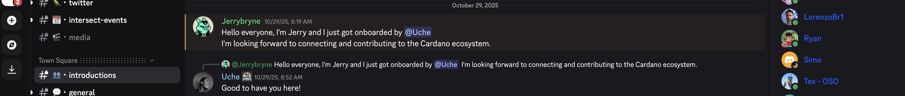

https://github.com/IntersectMBO/developer-experience/commit/9c5d1972464372af063c7fbb61296d19c756c57d

I successfully delivered on the acceptance criteria by actively engaging with developers in the community, connecting them to relevant working groups, and contributing to improved onboarding materials for the Cardano ecosystem.

Throughout the quarter, I supported new developer onboarding through both one-on-one engagements and in-person outreach. Notably, I onboarded Jerry, who connected via my public calendar for a dedicated session. During our discussion, I introduced him to Intersect, highlighted available participation opportunities, and guided him through the onboarding steps, resulting in his successful integration into the community Discord and broader ecosystem.

In addition, during my in-person event in Enugu, Nigeria, I engaged with several interested developers who sought to learn more about Core Cardano and Intersect. I provided them with direct guidance, encouraged involvement in Developer Experience and Technical Working Groups, and supported their onboarding into the Intersect community. These interactions contributed to exceeding the required target of onboarding at least two new developers for the quarter.

Beyond onboarding, I contributed to strengthening the developer ecosystem by creating documentation outlining the [various development opportunities within the Cardano ecosystem](https://github.com/IntersectMBO/developer-experience/pull/84). This material was added to the developer-experience repository under the IntersectMBO GitHub organization, enhancing the visibility of learning resources available to newcomers. This documentation also serves as a complementary resource to existing OSC and OSO onboarding materials.

Through these efforts, I helped grow participation in the Core Cardano working groups, improved the onboarding experience for new developers, and contributed meaningful documentation to support the broader community.