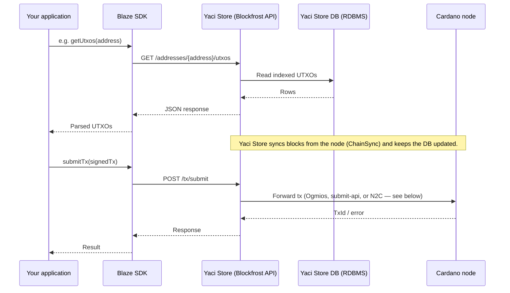
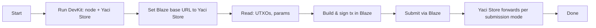

# Blaze SDK + Yaci DevKit

Use **Yaci DevKit** to run **Yaci Store** locally and point the **Blaze SDK** at its **Blockfrost-compatible REST API**. This guide covers architecture, how reads and transaction submission work, configuration, and a typical end-to-end flow.

## Architecture and flow



For API requests that fetch UTXOs for an address, **Yaci Store serves the data from its database** rather than querying the Cardano node on every request.

**Yaci Store** continuously syncs blocks from the Cardano node using the **ChainSync** mini-protocol and stores the processed data in its database. API endpoints then read that data directly from the **RDBMS**.

For **transaction submission**, Yaci Store operates in **one of three modes** depending on configuration. The HTTP URL for your app stays the same (for example `POST .../tx/submit`).

- **Ogmios:** If Ogmios is deployed with the Cardano node, Yaci Store submits transactions through Ogmios. In this mode, Yaci Store also enables the **evaluate** endpoint for script cost evaluation.
- **Submit API:** You can run the **submit-api** module with the node; submission goes through that server.
- **Direct to Cardano node:** This uses **N2C** configuration and normally requires a local node. If the node’s N2C socket is reachable remotely (for example via a TCP proxy such as **socat**), Yaci Store can connect that way.

**FYI:** **Yaci DevKit** (typical for local development) bundles **Ogmios** and **Submit API**, so you do not need to install them separately for DevKit flows. A **standalone Yaci Store** deployment does **not** include Ogmios or Submit API by default.

Yaci Store can sync blocks from a **remote** Cardano node or public endpoints, so a **local** node is not strictly required for every standalone deployment—but submission still needs one of the modes above configured to reach a node that accepts transactions.

- **Your app** uses the Blaze SDK (TypeScript/JavaScript).
- **Blaze SDK** calls a Blockfrost-style HTTP API (base URL + optional API key header).
- **Reads** are served from Yaci Store’s index; **submission** is forwarded to the node according to the active mode.

So: **App → Blaze → Yaci Store (HTTP)** for queries; **submission** is **App → Blaze → Yaci Store → (Ogmios / submit-api / N2C) → node** as configured.

## Prerequisites

| Requirement | Purpose |
|-------------|---------|
| **Cardano node** | Source of chain data via ChainSync; required for syncing (can be remote). Needed for tx submission in all modes. |
| **Yaci Store** | Running and exposing the Blockfrost-compatible REST API. |
| **Base URL** | Yaci Store’s Blockfrost API base URL. With Yaci DevKit defaults: **`http://localhost:8080/api/v1/`** (trailing slash recommended; see [Configuration](#configuration)). Swagger UI: `http://localhost:8080/swagger-ui/index.html`. |

Install and run Yaci DevKit per the [Yaci DevKit](https://devkit.yaci.xyz/) documentation so the Blockfrost API is enabled and reachable. Default ports: Cardano node **3001**, Yaci Store **8080**, Yaci Viewer **5173**.

For deeper Yaci Store behavior (stores, DB, deployment), see [Yaci Store documentation](https://store.yaci.xyz/).

## Configuration

Point Blaze at Yaci Store using Blaze’s **Blockfrost provider**. The provider builds request URLs as **`${baseUrl}${path}`** where `path` values look like `epochs/latest/parameters` (no leading slash). Hosted Blockfrost therefore uses a base URL ending in **`/api/v0/`**. For Yaci Store, use the same pattern with **`/api/v1/`** and a **trailing slash** so paths concatenate correctly.

1. **Base URL**  
   With [Yaci DevKit Docker](https://devkit.yaci.xyz/getting-started/docker), the Blockfrost-compatible API is at **`http://localhost:8080/api/v1/`**. Use that as the provider base (or your deployed URL + `/api/v1/` **with** a trailing slash).  
   **Note:** Yaci Store uses **`/api/v1/`**; Blockfrost.io uses **`/api/v0/`**.

2. **API key**  
   Local Yaci Store often does not require an API key. Pass an empty `projectId` if unused. For locked-down deployments, use the key your instance expects in the `project_id` header.

3. **Blaze setup**  
   Install: `npm i @blaze-cardano/sdk`. Blaze uses **`Blaze.from(provider, wallet)`** with the **Blockfrost** provider type. The published `Blockfrost` constructor takes **`{ network, projectId }`** and defaults to hosted Blockfrost URLs; for Yaci Store, set the public **`url`** field after construction so requests go to your indexer. See [Blaze](https://blaze.butane.dev/) and the [Blockfrost provider source](https://github.com/butaneprotocol/blaze-cardano/blob/main/packages/blaze-query/src/blockfrost.ts).

Example pattern (confirm `network` matches your devnet addresses and magic; DevKit is usually testnet-style):

```typescript
import { Blaze, Blockfrost, ColdWallet, Core } from "@blaze-cardano/sdk";

// Trailing slash: Blaze concatenates base + "epochs/latest/parameters", etc.
const YACI_STORE_BASE =
  process.env.BLOCKFROST_URL ?? "http://localhost:8080/api/v1/";

const provider = new Blockfrost({
  network: "cardano-preview", // or cardano-preprod / "unknown" — match your devnet
  projectId: process.env.BLOCKFROST_API_KEY ?? "",
});
provider.url = YACI_STORE_BASE;

const wallet = new ColdWallet(yourAddress, 0, provider);
const blaze = await Blaze.from(provider, wallet);

// Build and submit as per Blaze docs (e.g. .newTransaction().payLovelace().complete())
const tx = await blaze.newTransaction().payLovelace(recipient, amount).complete();
```

Use environment variables so you can switch between local Yaci Store and hosted Blockfrost without code changes (hosted: you can omit `provider.url` override and rely on the default Blockfrost host for your `network`).

## Interactions and API usage

Blaze uses Blockfrost-style endpoints for chain data and submission. Yaci Store implements these; your app talks to Blaze only.

| Interaction | Blaze (your code) | HTTP (Blaze → Yaci Store) | Purpose |
|-------------|-------------------|---------------------------|---------|
| Get UTXOs for address | e.g. `getUtxos(address)` | `GET /addresses/{address}/utxos` | Build inputs for a transaction. |
| Get transaction | e.g. `getTransaction(txHash)` | `GET /txs/{hash}` | Inspect a submitted or existing tx. |
| Submit transaction | e.g. `submitTx(signedTx)` | `POST /tx/submit` | Broadcast signed transaction. |
| Protocol parameters | e.g. `getProtocolParameters()` | `GET /epochs/latest/parameters` | Min fee, min ADA, etc. |

Flow in practice:

1. **Read:** Blaze calls Yaci Store (e.g. UTXOs, protocol params). Yaci Store answers from its indexed database (kept in sync with the node).
2. **Build:** Your app uses Blaze to assemble the transaction.
3. **Sign:** You sign with Blaze or your wallet/keys.
4. **Submit:** Blaze sends the signed CBOR to Yaci Store via `POST /tx/submit`; Yaci Store forwards to the node using the configured submission mode.

If an endpoint or response shape differs from Blockfrost for your Yaci Store version, check Blaze and [Yaci Store](https://store.yaci.xyz/) docs for compatibility.

## End-to-end flow (summary)



1. **Yaci DevKit:** Start containers and CLI: `devkit start` (curl install) or `./devkit.sh start` (zip install). In the Yaci CLI, create and start a devnet, for example: `create-node -o --start` (default ~1s block time). See [Docker setup](https://devkit.yaci.xyz/getting-started/docker) for options and ports.
2. Confirm the Blockfrost API is up: try **`GET http://localhost:8080/api/v1/health`** (Blockfrost-style health, if enabled in your build), **`GET`** a simple resource such as **`/addresses/{addr}/utxos`**, or open **`http://localhost:8080/swagger-ui/index.html`**.
3. Configure Blaze with Yaci Store’s base URL (**with trailing slash**) and API key if required.
4. Use Blaze for reads and submission; monitor DevKit / Yaci Store / node logs if submission fails.

## Advantages of this setup

- **Local control and privacy**: No third-party API key or quota for local DevKit. Data flows between your app, Yaci Store, and your devnet node.
- **Same API surface**: Blockfrost-compatible API lets you reuse patterns from other SDKs; switch environments via base URL and env vars.
- **Fast local dev and CI**: DevKit brings up node + indexer quickly, with configurable block times. Good for tests and iteration.
- **Cost and quotas**: No Blockfrost project limits on local runs.
- **Ecosystem alignment**: One local indexer can serve tools that expect Blockfrost-shaped responses.

## Limitations and drawbacks

- **Operations**: You run and update the node and Yaci Store (disk, monitoring). If either is down, Blaze loses chain access. Heavier than a hosted API alone.
- **API version path**: Yaci Store uses `/api/v1/`; Blockfrost.io uses `/api/v0/`. Confirm compatibility with your Blaze release. Browser apps may need CORS or a proxy for self-hosted Yaci Store.

## Compatibility notes

- **Base URL and trailing slash:** Blaze’s Blockfrost client concatenates the base URL with relative paths. Use a trailing slash on the base (e.g. `http://localhost:8080/api/v1/`) so requests resolve to `.../api/v1/epochs/...` and not `.../api/v1epochs/...`.
- **Network:** Align network id / magic across the node, Yaci Store, Blaze `network`, and your addresses.
- **CORS:** For browser apps, allow your origin on Yaci Store or use the same host / a reverse proxy.

## References

- [Blaze Cardano](https://blaze.butane.dev/): Blaze SDK and providers (Blockfrost, Kupmios, Maestro).
- [Yaci DevKit](https://devkit.yaci.xyz/): Local Cardano devnet with Yaci Store (Blockfrost API on port 8080).
- [Yaci DevKit Docker setup](https://devkit.yaci.xyz/getting-started/docker): `devkit start`, `create-node`, default ports, API base `http://localhost:8080/api/v1/`.
- [Yaci Store](https://store.yaci.xyz/): Indexer architecture, configuration, and APIs.

---

*This guide is part of the [Developer Experience](https://devex.intersectmbo.org/) initiative.*
