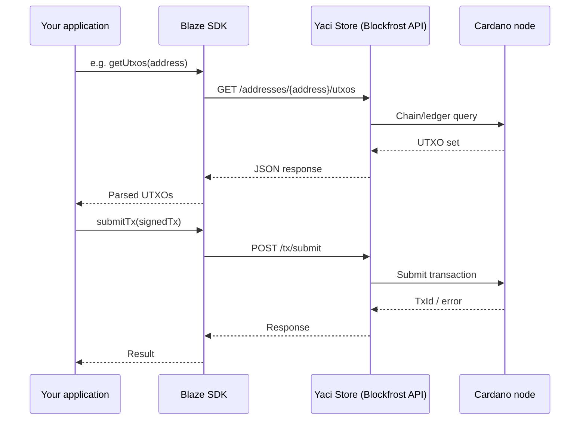
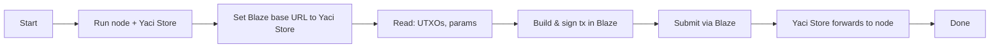

# Blaze SDK with Yaci Store

Use **Yaci Store** as a local Blockfrost-compatible indexer with **Blaze SDK**. This document describes the architecture, data flow, configuration, and typical interactions.

## Architecture and flow



- **Your app** uses the Blaze SDK (TypeScript/JavaScript).
- **Blaze SDK** talks to a Blockfrost-compatible HTTP API (base URL + optional API key).
- **Yaci Store** implements that API and reads/writes via a local **Cardano node**.

So: **App → Blaze → Yaci Store (HTTP) → Cardano node.** No direct Blaze-to-node connection; all chain access goes through Yaci Store.

## Prerequisites

| Requirement | Purpose |
|-------------|---------|
| **Cardano node** | Synced (mainnet/preview/preprod). Yaci Store connects to the node. |
| **Yaci Store** | Running and exposing the Blockfrost-compatible REST API. |
| **Base URL** | Yaci Store’s Blockfrost API base URL. When run via Yaci DevKit it is **`http://localhost:8080/api/v1`** (Swagger UI: `http://localhost:8080/swagger-ui/index.html`). |

Install and run Yaci Store (and its dependencies) per the [Yaci DevKit](https://devkit.yaci.xyz/) documentation so the Blockfrost API is enabled and reachable. Default ports: Cardano node **3001**, Yaci Store **8080**, Yaci Viewer **5173**.

## Configuration

Point Blaze at Yaci Store by using Blaze’s **built-in Blockfrost provider** with Yaci Store’s base URL.

1. **Base URL**  
   Yaci Store exposes the Blockfrost-compatible API at **`http://localhost:8080/api/v1`** when run via [Yaci DevKit](https://devkit.yaci.xyz/getting-started/docker). Use this as the provider base URL (or your deployed Yaci Store URL + `/api/v1`).  
   **Note:** Yaci Store uses **`/api/v1`**; Blockfrost.io uses **`/api/v0`**. If Blaze’s Blockfrost provider assumes a path, ensure the base URL you pass results in the correct path (e.g. `http://localhost:8080/api/v1`).

2. **API key**  
   Local Yaci Store typically does not require an API key. Pass an empty string or omit if the SDK allows. For deployed Yaci Store, use the key your instance expects.

3. **Blaze setup**  
   Install the SDK: `npm i @blaze-cardano/sdk`. Blaze uses **`Blaze.from(provider, wallet)`** and supports Blockfrost as a built-in provider. See [Blaze docs](https://blaze.butane.dev/) and the [Blockfrost provider source](https://github.com/butaneprotocol/blaze-cardano/blob/main/packages/blaze-query/src/blockfrost.ts) for the exact constructor (e.g. base URL and API key).

Example pattern (verify import names against [Blaze docs](https://blaze.butane.dev/) and `@blaze-cardano/sdk` exports):

```typescript
import { Blaze, Blockfrost, ColdWallet, Core } from "@blaze-cardano/sdk";

// Yaci Store Blockfrost API (Yaci DevKit default)
const YACI_STORE_URL = process.env.BLOCKFROST_URL ?? "http://localhost:8080/api/v1";
const YACI_STORE_API_KEY = process.env.BLOCKFROST_API_KEY ?? "";

const provider = new Blockfrost(YACI_STORE_URL, YACI_STORE_API_KEY);
const wallet = new ColdWallet(yourAddress, 0, provider);
const blaze = await Blaze.from(provider, wallet);

// Build and submit as per Blaze docs (e.g. .newTransaction().payLovelace().complete())
const tx = await blaze.newTransaction().payLovelace(recipient, amount).complete();
```

Use environment variables so you can switch between local Yaci Store and hosted Blockfrost without code changes.

## Interactions and API usage

Blaze uses Blockfrost-style endpoints for chain data and submission. Yaci Store implements these; your app only talks to Blaze.

| Interaction | Blaze (your code) | HTTP (Blaze → Yaci Store) | Purpose |
|-------------|-------------------|---------------------------|---------|
| Get UTXOs for address | e.g. `getUtxos(address)` | `GET /addresses/{address}/utxos` | Build inputs for a transaction. |
| Get transaction | e.g. `getTransaction(txHash)` | `GET /txs/{hash}` | Inspect a submitted or existing tx. |
| Submit transaction | e.g. `submitTx(signedTx)` | `POST /tx/submit` | Broadcast signed transaction. |
| Protocol parameters | e.g. `getProtocolParameters()` | `GET /epochs/latest/parameters` | Min fee, min ADA, etc. |

Flow in practice:

1. **Read**: Blaze calls Yaci Store (e.g. UTXOs, protocol params). Yaci Store queries the node and returns Blockfrost-shaped JSON.
2. **Build**: Your app uses Blaze to build the transaction (inputs, outputs, minting, etc.) using that data.
3. **Sign**: You sign with Blaze (or your own keys/wallet).
4. **Submit**: Blaze sends the signed CBOR to Yaci Store via `POST /tx/submit`; Yaci Store forwards to the node.

If an endpoint or response shape differs from Blockfrost (e.g. older Blaze or custom Yaci Store version), check Blaze SDK and Yaci Store docs for compatibility.

## End-to-end flow (summary)



1. Run Cardano node and Yaci Store; confirm the Blockfrost API is up (e.g. `GET /health` or a simple `GET /addresses/...` if available).
2. Configure Blaze with Yaci Store’s base URL (and API key if required).
3. Use Blaze for all chain reads and submission; Blaze will use Yaci Store as the Blockfrost backend.
4. Monitor node and Yaci Store logs for errors; for submission issues, confirm the node accepts the tx and that Yaci Store is not rate-limiting or returning non-standard errors.

## Advantages of this setup

- **Local control and privacy**: No dependency on a third-party API key or rate limits. All chain data stays between your app, Yaci Store, and your node. Useful for sensitive or high-volume workflows.
- **Same API surface**: Yaci Store is Blockfrost-compatible, so you keep the same Blaze code and can switch between local (Yaci Store) and hosted (Blockfrost) by changing the provider base URL (e.g. via env vars). No SDK rewrite.
- **Fast local dev and CI**: With Yaci DevKit you get a full devnet (node + Yaci Store) in seconds, sub-second block times, and no network latency. Ideal for automated tests and rapid iteration.
- **Cost and quotas**: No Blockfrost project limits or usage-based cost for local runs. Suits development, staging, and self-hosted production where you operate the node and indexer.
- **Ecosystem alignment**: Reuses the same Blockfrost-style APIs that other Cardano SDKs (Mesh, Lucid, PyCardano, CCL) expect, so one local indexer can serve multiple tools and docs.

## Limitations and drawbacks

- **Operational overhead**: You must run and maintain a Cardano node and Yaci Store (updates, disk, monitoring). If either is down, Blaze has no chain access. Heavier on CPU, RAM, and storage than using a hosted API.
- **API and CORS**: Yaci Store uses `/api/v1` while Blockfrost.io uses `/api/v0`; verify compatibility with your Blaze version. For browser apps, CORS or a proxy is required when calling self-hosted Yaci Store.

## Compatibility notes

- **API path**: Yaci Store serves the Blockfrost-compatible API at **`/api/v1`**; Blockfrost.io uses **`/api/v0`**. Pass the full base URL including path (e.g. `http://localhost:8080/api/v1`) so the SDK hits the correct endpoints. If Blaze’s Blockfrost provider appends a path, you may need to set the base URL to `http://localhost:8080` and confirm path compatibility with Yaci Store.
- **Network**: Use the same network (mainnet, preview, preprod) in the node, Yaci Store, and Blaze (network id / magic).
- **CORS**: For browser apps, ensure Yaci Store allows requests from your app’s origin, or run the app and Yaci Store in a way that avoids cross-origin calls (e.g. same host or proxy).

## References

- [Blaze Cardano](https://blaze.butane.dev/): Blaze SDK documentation and providers (Blockfrost, Kupmios, Maestro).
- [Yaci DevKit](https://devkit.yaci.xyz/): Local Cardano devnet with Yaci Store (Blockfrost API on port 8080).
- [Yaci DevKit Docker setup](https://devkit.yaci.xyz/getting-started/docker): Default ports and Yaci Store API URL (`http://localhost:8080/api/v1`).

---

*This guide is part of the [Developer Experience](https://devex.intersectmbo.org/) initiative.*
