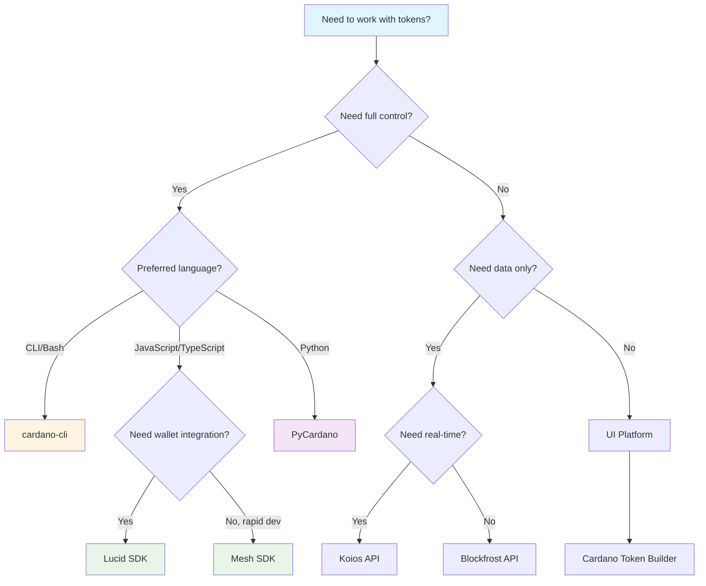

# Native Tokens Resources

Comprehensive collection of tools, libraries, platforms, and documentation for working with Cardano native tokens.

## Quick Reference: Tool Selection

### Tool Comparison Matrix

| Tool | Control Level | Complexity | Best For | Language |
|------|---------------|------------|----------|----------|
| **cardano-cli** | Full control | High | Automation, scripts, advanced | CLI |
| **Lucid** | High | Medium | Web dApps, wallet integration | JavaScript/TypeScript |
| **Mesh SDK** | Medium | Low | Rapid prototyping, beginners | JavaScript/TypeScript |
| **PyCardano** | High | Medium | Python projects, data analysis | Python |
| **Blockfrost API** | Read-only | Low | Data queries, transaction submission | Any (REST) |
| **Koios API** | Read-only | Low | Chain data, real-time queries | Any (REST) |

### Decision Tree



### Quick Start Guides

#### cardano-cli (5 minutes)

```bash
# 1. Install cardano-node (includes CLI)
# See: https://docs.cardano.org/getting-started/installing-the-cardano-node

# 2. Generate policy keys
cardano-cli address key-gen \
  --verification-key-file policy.vkey \
  --signing-key-file policy.skey

# 3. Create simple policy
echo '{"type":"sig","keyHash":"'$(cardano-cli address key-hash --payment-verification-key-file policy.vkey)'"}' > policy.json

# 4. Get policy ID
cardano-cli transaction policyid --script-file policy.json
```

**Documentation:** [CLI Reference](https://github.com/IntersectMBO/cardano-node/tree/master/doc/reference) | [Cardano Docs](https://docs.cardano.org/)

#### Lucid SDK (5 minutes)

```bash
npm install lucid-cardano
```

```javascript
import { Lucid, Blockfrost } from "lucid-cardano";

const lucid = await Lucid.new(
  new Blockfrost("https://cardano-preview.blockfrost.io/api/v0", "API_KEY"),
  "Preview"
);

// Connect wallet or use keys
await lucid.selectWalletFromSeed("seed phrase");

// Mint token
const tx = await lucid
  .newTx()
  .mintAssets({ [policyId + assetName]: 1000n }, policyScript)
  .complete();
```

**Documentation:** [Lucid Docs](https://lucid.spacebudz.io/) | [GitHub](https://github.com/spacebudz/lucid)

#### Mesh SDK (5 minutes)

```bash
npm install @martifylabs/mesh
```

```javascript
import { MeshWallet } from "@martifylabs/mesh";

const wallet = await MeshWallet.enable("eternl");

// Mint token
const tx = await wallet.mintToken({
  policyId: "policyId...",
  assetName: "MyToken",
  quantity: "1000"
});
```

**Documentation:** [Mesh Docs](https://mesh.martify.io/) | [GitHub](https://github.com/MeshJS/mesh)

#### PyCardano (5 minutes)

```bash
pip install pycardano
```

```python
from pycardano import *

network = Network.TESTNET
context = BlockFrostChainContext("API_KEY", network=network)

# Mint token
builder = TransactionBuilder(context)
builder.mint = {policy_id + asset_name: 1000}
signed_tx = builder.build_and_sign([skey])
context.submit_tx(signed_tx.to_cbor())
```

**Documentation:** [PyCardano Docs](https://pycardano.readthedocs.io/) | [GitHub](https://github.com/Python-Cardano/pycardano)

---

## Tools by Use Case

### Minting Tokens

| Tool | Complexity | Control | Best For |
|------|------------|---------|----------|
| **Cardano Token Builder** | Low | Low | Non-developers, quick mints |
| **cardano-cli** | High | Full | Scripts, automation |
| **Lucid SDK** | Medium | High | dApps, web integration |
| **Mesh SDK** | Low | Medium | Rapid prototyping |
| **PyCardano** | Medium | High | Python projects |

### Building dApps

| Tool | Wallet Integration | Transaction Building | Best For |
|------|-------------------|---------------------|----------|
| **Lucid** | ✅ CIP-30 | ✅ Full control | Production dApps |
| **Mesh SDK** | ✅ CIP-30 | ✅ Simplified API | Quick prototypes |
| **cardano-serialization-lib** | Manual | ✅ Low-level | Custom implementations |

### Querying Data

| Tool | Type | Features | Best For |
|------|------|----------|----------|
| **Blockfrost** | REST API | UTXOs, transactions, metadata | General queries |
| **Koios** | REST API | Real-time, chain data | Live data needs |
| **CardanoDBLite** | Local DB | Custom queries, indexing | Advanced analysis |

---

## User-Friendly Platforms

### Cardano Token Builder
- **URL:** [cardano-native-token.com](https://cardano-native-token.com/en)
- **Purpose:** Simple token and NFT creation
- **Best For:** Non-developers, quick mints
- **Features:**
  - Web-based UI
  - No coding required
  - Metadata support
  - Trusted since 2020

### NFT-Maker
- **URL:** [nft-maker.io](https://nft-maker.io/)
- **Purpose:** NFT creation platform
- **Best For:** NFT collections
- **Features:**
  - Specialized NFT minting
  - Metadata management
  - Batch minting

### Tokhun
- **URL:** [tokhun.io](https://tokhun.io/)
- **Purpose:** Token and NFT marketplace with minting
- **Best For:** Minting and trading in one platform
- **Features:**
  - Marketplace integration
  - Minting tools
  - Trading capabilities

> **Note:** These platforms provide UI-based minting. For developers, using CLI or SDKs offers more control and flexibility.

---

## Development Resources

### Testnets
- **[Testnets Documentation](https://docs.cardano.org/cardano-testnets)** - Testnet information
- **Preprod Testnet** - Stable testnet environment (magic: 1)
- **Preview Testnet** - Latest features testing (magic: 2)
- **Testnet Faucets:**
  - [Cardano Testnets](https://docs.cardano.org/cardano-testnets/testnet)
  - [Testnet ADA Faucet](https://testnets.cardano.org/en/testnets/cardano/tools/faucet/)

### Security
- **[IOG Security Handbook](https://input-output-hk.github.io/cardano-engineering-handbook/policy/security/index.html)** - Security best practices
- **[Key Management](https://docs.cardano.org/cardano-node/key-management)** - Key handling guidelines | [CLI Key Commands](https://github.com/IntersectMBO/cardano-node/tree/master/doc/reference)

### Smart Contracts Integration
- **[Plutus Documentation](https://docs.cardano.org/developer-resources/plutus)** - Smart contract platform
- **[Smart Contracts Guide](https://docs.cardano.org/developer-resources/smart-contracts)** - Contract development

---

## Learning Resources

### Tutorials & Guides
- **[Developer Portal](https://developers.cardano.org/)** - Main developer portal
- **[Cardano Docs](https://docs.cardano.org/)** - Official documentation hub
- **[Plutus Pioneer Program](https://plutuspbl.io/)** - Comprehensive learning program

### Community
- **[Cardano Stack Exchange](https://cardano.stackexchange.com)** - Q&A platform
- **[Cardano Forum](https://forum.cardano.org/)** - Community discussions
- **[Discord](https://discord.gg/cardano)** - Real-time community chat

---

## Tool Integration Examples

### Using Blockfrost with Lucid

```javascript
import { Lucid, Blockfrost } from "lucid-cardano";

const lucid = await Lucid.new(
  new Blockfrost("https://cardano-preview.blockfrost.io/api/v0", "API_KEY"),
  "Preview"
);
```

### Using Koios for Data Queries

```javascript
// Query UTXOs
const response = await fetch(
  "https://preview.koios.rest/api/v0/address_info",
  {
    method: "POST",
    body: JSON.stringify({ _addresses: ["addr1..."] })
  }
);
```

### CLI + API Workflow

```bash
# 1. Query UTXOs via Blockfrost
curl "https://cardano-preview.blockfrost.io/api/v0/addresses/addr1.../utxos" \
  -H "project_id: YOUR_API_KEY"

# 2. Build transaction with CLI
cardano-cli transaction build --tx-in ...

# 3. Submit via Blockfrost
curl -X POST "https://cardano-preview.blockfrost.io/api/v0/tx/submit" \
  -H "project_id: YOUR_API_KEY" \
  -H "Content-Type: application/cbor" \
  --data-binary @tx.signed
```

---

## Hands-On Repository

### Cardano Native Tokens Demo

Hands-on project to explore native token operations including minting, burning, and transferring tokens. This repository will be updated with comprehensive examples for working with Cardano native tokens.

> **Note:** This repository will be updated with native token (NT) minting and burning examples. The repository is open source—feel free to clone, test, and contribute!

<a href="https://github.com/danbaruka/cardano-demo-wallet-dashbord" target="_blank" rel="noopener noreferrer">
  
</a>

---

## Related Session Materials

- **[Session Notes](../session-notes/readme.md)** - Complete native tokens guide
- **[Session Recordings](../recordings/readme.md)** - Video recordings

---

*Referenced by the Q1 2025 Developer Experience Working Group session "Open Clinic #1 - Native Tokens".*
