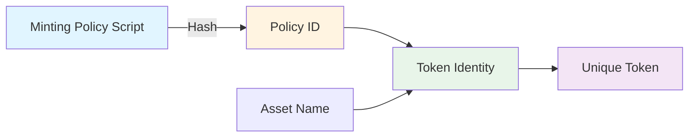
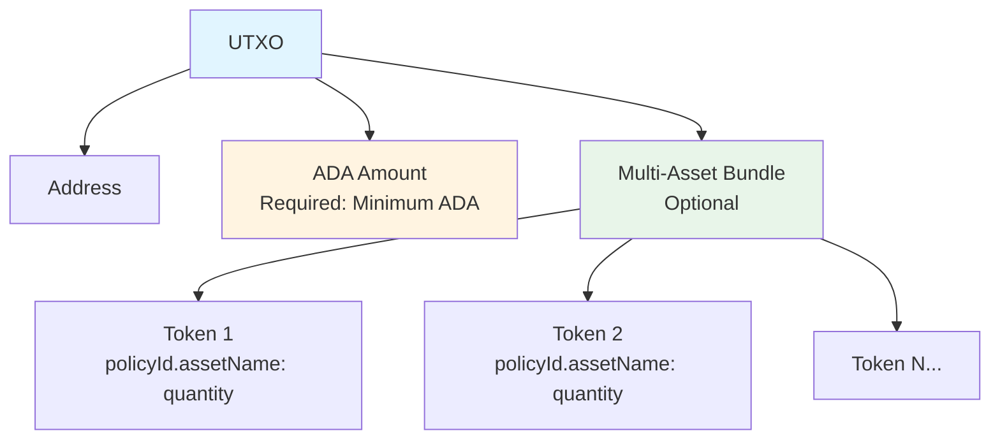
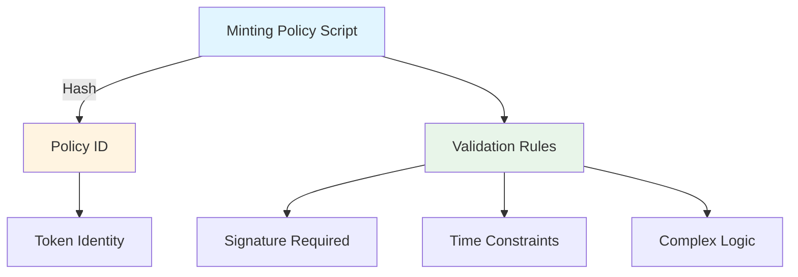
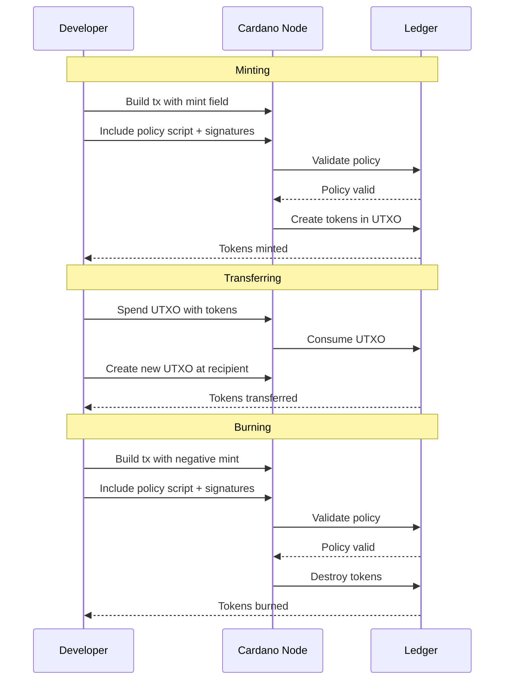
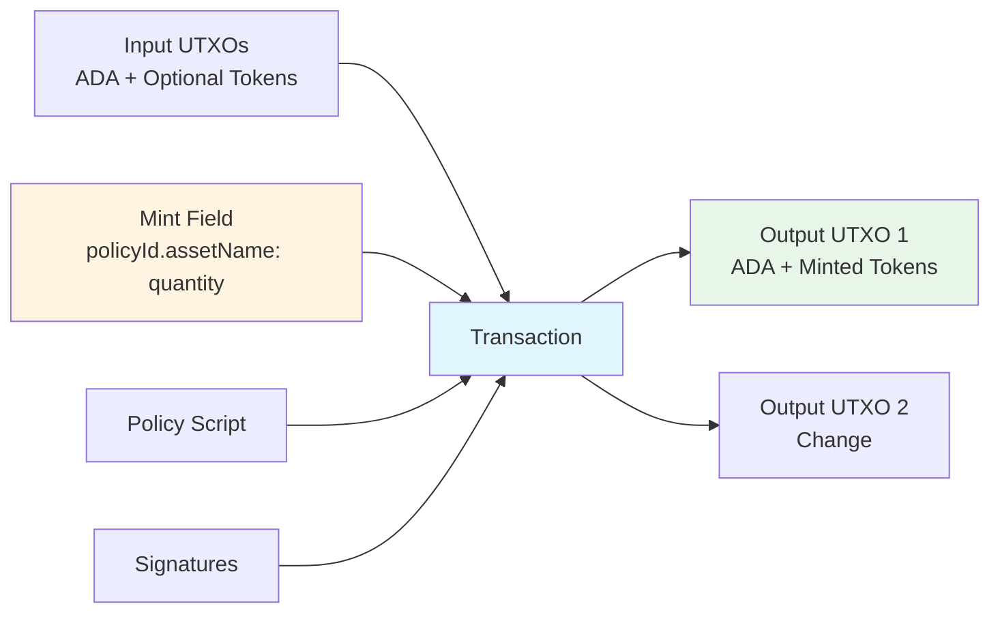
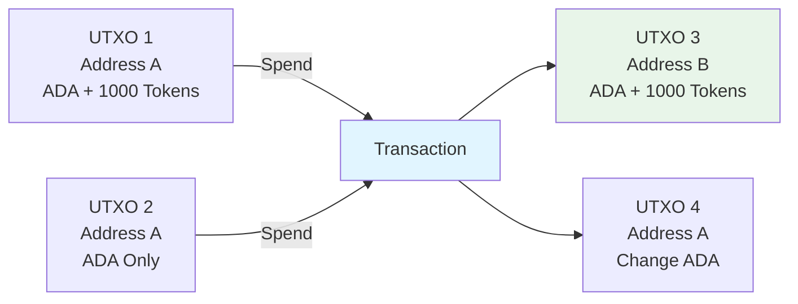
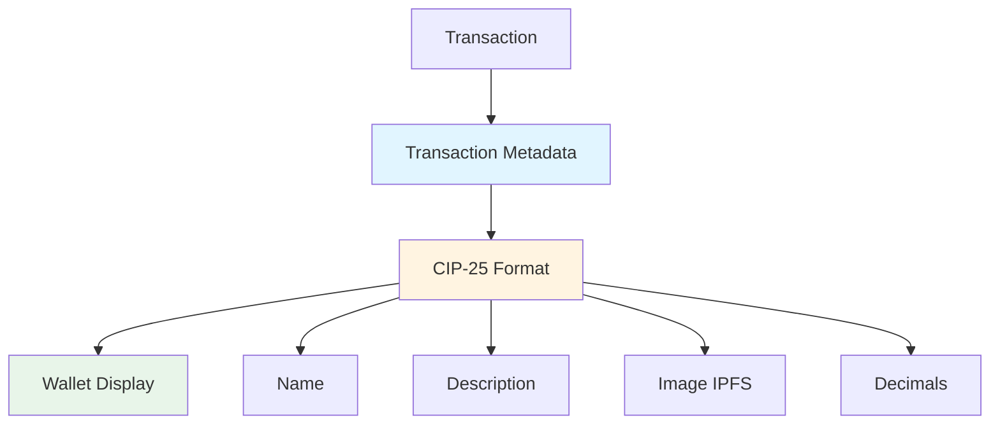

# Cardano Native Tokens

Native tokens are custom assets on Cardano that work just like ADA, but are created by users instead of the protocol. They are built directly into the ledger, so they don't need smart contracts to function.

**Key Difference from ADA:**
- **ADA** is the base currency created by the protocol—it's used for fees, staking, and as the foundation currency
- **Native Tokens** are custom assets you create—they share the same ledger rules as ADA but cannot be used to pay fees

**Key Difference from NFT:**
- **NFTs** are native tokens with a supply of 1—each NFT is unique and cannot be divided
- **Fungible Tokens** are native tokens with a supply greater than 1—they can be divided and transferred in any quantity
- Both use the same ledger model and technical structure—the difference is in supply and use case, not implementation

Both ADA and native tokens live in UTXOs and move the same way. If you understand how UTXOs work, you already understand how tokens work.

## Quick Reference

| Aspect | ADA | Native Tokens |
|--------|-----|---------------|
| **Issuance** | Protocol-defined | User-defined via minting policy |
| **Fees** | Required for fees and min-ADA | Cannot pay fees (ADA only) |
| **Ledger Support** | Built-in | Built-in, no smart contract needed |
| **Supply Control** | Protocol rules | Policy-controlled mint/burn |
| **Common Usage** | Fees, staking, base currency | Assets, utility, governance, NFTs |

**Key Mental Model:** Tokens are not smart contracts. They are additional asset entries in UTXO values. Token ownership = "this address controls this UTXO that holds ADA plus these assets."

---

## Core Concepts

### Token Identity

Every token is uniquely identified by a **Policy ID** and an **Asset Name**:

```
Token = PolicyID + AssetName
PolicyID = Hash(MintingPolicyScript)
```



**Important:** Policy IDs are network-specific. The same script produces different policy IDs on testnet vs mainnet.

### UTXO Structure

A UTXO contains an address, ADA amount, and an optional multi-asset bundle:



**Structure Example:**
```json
{
  "address": "addr1...",
  "value": {
    "lovelace": 2000000,
    "policyId123.assetName": 1000,
    "policyId456.otherAsset": 500
  }
}
```

### Minimum ADA Requirement

Every UTXO must contain a minimum ADA amount. The minimum increases with the number of **distinct token types** (not quantities):

- More distinct tokens = more ADA required
- Policy IDs and asset names consume space
- This is why transactions can fail even when wallets show token balances

**Common Issue:** "Cannot balance transaction" often means the output doesn't meet minimum ADA requirements.

### Minting Policies

A minting policy is a script that defines rules for minting and burning tokens. The policy script is hashed to create the policy ID.



**Policy Types:**

| Type | Description | Use Case |
|------|-------------|----------|
| **Signature-based** | Requires key signature(s) | Simple tokens, flexible minting |
| **Time-locked** | Signature + time window | Fixed supply after initial mint |
| **Complex** | Multiple conditions or Plutus | Advanced control, governance |

**Example Policy Scripts:**

#### 1. Simple Signature Policy (Most Common)

**Use Case:** Flexible minting, single key control

```json
{
  "type": "sig",
  "keyHash": "a1b2c3d4e5f6789012345678901234567890abcdef1234567890abcdef123456"
}
```

**How to Create:**
```bash
# 1. Generate key pair
cardano-cli address key-gen \
  --verification-key-file policy.vkey \
  --signing-key-file policy.skey

# 2. Get key hash
KEY_HASH=$(cardano-cli address key-hash --payment-verification-key-file policy.vkey)

# 3. Create policy.json
cat > policy.json <<EOF
{
  "type": "sig",
  "keyHash": "$KEY_HASH"
}
EOF

# 4. Get policy ID
cardano-cli transaction policyid --script-file policy.json
```

#### 2. Time-Locked Policy (Before Slot)

**Use Case:** Fixed supply token - lock minting after a specific slot

```json
{
  "type": "all",
  "scripts": [
    {
      "type": "sig",
      "keyHash": "a1b2c3d4e5f6789012345678901234567890abcdef1234567890abcdef123456"
    },
    {
      "type": "before",
      "slot": 12345678
    }
  ]
}
```

**How to Create:**
```bash
# 1. Get current slot (for reference)
cardano-cli query tip --testnet-magic 1

# 2. Calculate future slot (e.g., 7 days from now)
# Slot = current_slot + (7 * 24 * 60 * 60 / slot_length)
# For testnet: ~1 slot per second, so 7 days = ~604,800 slots

# 3. Create policy with before slot
cat > policy.json <<EOF
{
  "type": "all",
  "scripts": [
    {
      "type": "sig",
      "keyHash": "$(cardano-cli address key-hash --payment-verification-key-file policy.vkey)"
    },
    {
      "type": "before",
      "slot": 12345678
    }
  ]
}
EOF
```

#### 3. Time-Locked Policy (After Slot)

**Use Case:** Delayed minting - only allow minting after a specific date

```json
{
  "type": "all",
  "scripts": [
    {
      "type": "sig",
      "keyHash": "a1b2c3d4e5f6789012345678901234567890abcdef1234567890abcdef123456"
    },
    {
      "type": "after",
      "slot": 10000000
    }
  ]
}
```

#### 4. Multi-Signature Policy (Require All)

**Use Case:** Governance tokens, multi-party control

```json
{
  "type": "all",
  "scripts": [
    {
      "type": "sig",
      "keyHash": "a1b2c3d4e5f6789012345678901234567890abcdef1234567890abcdef123456"
    },
    {
      "type": "sig",
      "keyHash": "b2c3d4e5f6789012345678901234567890abcdef1234567890abcdef1234567890"
    },
    {
      "type": "sig",
      "keyHash": "c3d4e5f6789012345678901234567890abcdef1234567890abcdef1234567890ab"
    }
  ]
}
```

**How to Create:**
```bash
# Generate multiple key pairs
for i in 1 2 3; do
  cardano-cli address key-gen \
    --verification-key-file policy$i.vkey \
    --signing-key-file policy$i.skey
done

# Get all key hashes
KEY1=$(cardano-cli address key-hash --payment-verification-key-file policy1.vkey)
KEY2=$(cardano-cli address key-hash --payment-verification-key-file policy2.vkey)
KEY3=$(cardano-cli address key-hash --payment-verification-key-file policy3.vkey)

# Create multi-sig policy
cat > policy.json <<EOF
{
  "type": "all",
  "scripts": [
    {"type": "sig", "keyHash": "$KEY1"},
    {"type": "sig", "keyHash": "$KEY2"},
    {"type": "sig", "keyHash": "$KEY3"}
  ]
}
EOF
```

#### 5. Multi-Signature Policy (Require Any)

**Use Case:** Backup keys, any of several keys can mint

```json
{
  "type": "any",
  "scripts": [
    {
      "type": "sig",
      "keyHash": "a1b2c3d4e5f6789012345678901234567890abcdef1234567890abcdef123456"
    },
    {
      "type": "sig",
      "keyHash": "b2c3d4e5f6789012345678901234567890abcdef1234567890abcdef1234567890"
    }
  ]
}
```

#### 6. Complex Policy (Time Window + Signature)

**Use Case:** Limited-time minting window with signature requirement

```json
{
  "type": "all",
  "scripts": [
    {
      "type": "sig",
      "keyHash": "a1b2c3d4e5f6789012345678901234567890abcdef1234567890abcdef123456"
    },
    {
      "type": "any",
      "scripts": [
        {
          "type": "before",
          "slot": 15000000
        },
        {
          "type": "after",
          "slot": 10000000
        }
      ]
    }
  ]
}
```

**Explanation:** This policy requires:
- A valid signature from the key
- AND (the transaction slot is before 15,000,000 OR after 10,000,000)
- Effectively creates a time window between slots 10M and 15M

#### 7. Production-Ready Fixed Supply Policy

**Use Case:** One-time mint, then permanently lock

```json
{
  "type": "all",
  "scripts": [
    {
      "type": "sig",
      "keyHash": "a1b2c3d4e5f6789012345678901234567890abcdef1234567890abcdef123456"
    },
    {
      "type": "before",
      "slot": 12345678
    }
  ]
}
```

**Production Workflow:**
```bash
# 1. Create policy with future lock date
# 2. Mint all tokens in one transaction
# 3. After minting completes:
#    - Destroy policy.skey (rm policy.skey)
#    - Store policy.vkey securely (for verification only)
#    - Policy is now permanently locked
```

**Complete Example: Creating and Using a Policy**

```bash
#!/bin/bash
# Complete workflow for creating and using a minting policy

# Step 1: Generate policy keys
cardano-cli address key-gen \
  --verification-key-file policy.vkey \
  --signing-key-file policy.skey

# Step 2: Get key hash
KEY_HASH=$(cardano-cli address key-hash --payment-verification-key-file policy.vkey)
echo "Key Hash: $KEY_HASH"

# Step 3: Get current slot (for time-locked policies)
CURRENT_SLOT=$(cardano-cli query tip --testnet-magic 1 | jq .slot)
LOCK_SLOT=$((CURRENT_SLOT + 604800))  # 7 days from now
echo "Current Slot: $CURRENT_SLOT"
echo "Lock Slot: $LOCK_SLOT"

# Step 4: Create time-locked policy
cat > policy.json <<EOF
{
  "type": "all",
  "scripts": [
    {
      "type": "sig",
      "keyHash": "$KEY_HASH"
    },
    {
      "type": "before",
      "slot": $LOCK_SLOT
    }
  ]
}
EOF

# Step 5: Get policy ID
POLICY_ID=$(cardano-cli transaction policyid --script-file policy.json)
echo "Policy ID: $POLICY_ID"

# Step 6: Use policy ID in minting transactions
# (See minting examples in Quick Start section)
```

**Critical Security Notes:**
- Losing policy keys = permanent loss of mint/burn capability
- For fixed supply: lock or destroy keys after minting
- Wrong network = different policy ID = different asset

---

## Implementation Guide

### Quick Start: Mint Your First Token

**Prerequisites:**
- Cardano node running (or use testnet)
- `cardano-cli` installed
- Testnet ADA (from faucet)

**Step 1: Generate Policy Keys**
```bash
# Generate key pair
cardano-cli address key-gen \
  --verification-key-file policy.vkey \
  --signing-key-file policy.skey

# Get key hash
cardano-cli address key-hash --payment-verification-key-file policy.vkey
```

**Step 2: Create Policy Script**
```json
{
  "type": "sig",
  "keyHash": "YOUR_KEY_HASH_HERE"
}
```

Save as `policy.json`.

**Step 3: Get Policy ID**
```bash
cardano-cli transaction policyid --script-file policy.json
```

**Step 4: Build Minting Transaction**
```bash
# Query UTXOs
cardano-cli query utxo --testnet-magic 1 --address $(cat payment.addr)

# Build transaction
cardano-cli transaction build \
  --testnet-magic 1 \
  --tx-in <UTXO_HASH>#<UTXO_INDEX> \
  --tx-out $(cat payment.addr)+1000000+"1000 <POLICY_ID>.MyToken" \
  --mint "1000 <POLICY_ID>.MyToken" \
  --mint-script-file policy.json \
  --change-address $(cat payment.addr) \
  --out-file mint.raw

# Sign transaction
cardano-cli transaction sign \
  --tx-body-file mint.raw \
  --signing-key-file payment.skey \
  --signing-key-file policy.skey \
  --testnet-magic 1 \
  --out-file mint.signed

# Submit transaction
cardano-cli transaction submit \
  --testnet-magic 1 \
  --tx-file mint.signed
```

### Token Lifecycle



### Minting Transaction Structure



**Transaction JSON Example:**
```json
{
  // Transaction body type identifier
  "type": "TxBody",
  // List of UTXOs being consumed (spent) in this transaction
  "inputs": [
    {
      // Transaction hash (ID) of the UTXO being spent
      "txId": "abc123...",
      // Index of the output in the referenced transaction (0 = first output)
      "index": 0
    }
  ],
  // List of new UTXOs being created (outputs)
  "outputs": [
    {
      // Recipient address where the UTXO will be sent
      "address": "addr1...",
      // Value contained in this output UTXO
      "value": {
        // ADA amount in lovelace (1 ADA = 1,000,000 lovelace)
        "lovelace": 2000000,
        // Native token: policyId.assetName = quantity
        "policyId.assetName": 1000
      }
    }
  ],
  // Minting field: defines which tokens to create (positive) or burn (negative)
  "mint": {
    // Mint 1000 tokens of this asset (negative value would burn)
    "policyId.assetName": 1000
  },
  // Transaction fee in lovelace (paid to network validators)
  "fee": 170000,
  // Cryptographic proofs required to validate the transaction
  "witnesses": {
    // Policy scripts required for minting/burning (must match mint field)
    "scripts": [{"policy": "..."}],
    // Signatures from required keys (payment keys + policy keys if minting)
    "keys": ["..."]
  }
}
```

### Transferring Tokens

Transferring tokens is simply spending a UTXO that contains tokens and creating new UTXOs:



**CLI Example:**
```bash
# Build transfer transaction
cardano-cli transaction build \
  --testnet-magic 1 \
  --tx-in <UTXO_WITH_TOKENS>#0 \
  --tx-in <UTXO_FOR_FEES>#1 \
  --tx-out <RECIPIENT_ADDRESS>+2000000+"1000 <POLICY_ID>.MyToken" \
  --change-address $(cat payment.addr) \
  --out-file transfer.raw
```

### Burning Tokens

Burning uses a negative quantity in the mint field:

```bash
# Build burn transaction
cardano-cli transaction build \
  --testnet-magic 1 \
  --tx-in <UTXO_WITH_TOKENS>#0 \
  --mint "-500 <POLICY_ID>.MyToken" \
  --mint-script-file policy.json \
  --change-address $(cat payment.addr) \
  --out-file burn.raw
```

---

## Metadata (CIP-25)

Wallets read CIP-25 metadata to display token information. Metadata is included in the transaction and is immutable once minted.

### Metadata Structure



**CIP-25 Format:**
```json
{
  "721": {
    "policyId": {
      "assetName": {
        "name": "My Token",
        "description": "Token description",
        "image": "ipfs://Qm...",
        "mediaType": "image/png",
        "files": []
      }
    }
  }
}
```

**Important Notes:**
- Asset names are **case-sensitive** and must match exactly
- Use **IPFS** for images (HTTP URLs can break)
- Decimals are display-only (ledger stores integers)
- If metadata doesn't appear: check format, encoding, and wallet cache

**Adding Metadata (CLI):**
```bash
# Create metadata JSON
cat > metadata.json <<EOF
{
  "721": {
    "$(cat policy.id)": {
      "MyToken": {
        "name": "My Token",
        "description": "A test token",
        "image": "ipfs://Qm..."
      }
    }
  }
}
EOF

# Include in transaction
cardano-cli transaction build \
  --testnet-magic 1 \
  --tx-in ... \
  --tx-out ... \
  --mint ... \
  --metadata-json-file metadata.json \
  --out-file mint.raw
```

---

## Common Patterns

### Fixed Supply Token

**Pattern:** Mint all tokens in one transaction, then lock/destroy policy keys.

```bash
# 1. Mint total supply
cardano-cli transaction build \
  --mint "1000000 <POLICY_ID>.Token" \
  --mint-script-file policy.json \
  ...

# 2. After minting, destroy keys
rm policy.skey policy.vkey  # Or store securely offline
```

### Time-Locked Policy

**Pattern:** Allow minting only before a specific slot.

```json
{
  "type": "all",
  "scripts": [
    {"type": "sig", "keyHash": "abc123..."},
    {"type": "before", "slot": 12345678}
  ]
}
```

### Multi-Signature Policy

**Pattern:** Require multiple signatures to mint.

```json
{
  "type": "all",
  "scripts": [
    {"type": "sig", "keyHash": "key1..."},
    {"type": "sig", "keyHash": "key2..."},
    {"type": "sig", "keyHash": "key3..."}
  ]
}
```

---

## Troubleshooting

### Common Errors and Solutions

| Error | Cause | Solution |
|-------|-------|----------|
| **"Cannot balance transaction"** | Output doesn't meet minimum ADA | Add more ADA to output |
| **"Missing policy script"** | Policy script not included | Add `--mint-script-file` |
| **"Policy validation failed"** | Wrong signatures or keys | Verify signing keys match policy |
| **"Token not showing in wallet"** | Metadata format issue or cache | Check CIP-25 format, wait for cache refresh |
| **"Wrong policy ID"** | Wrong network or script | Verify network and policy script match |

### Querying Token Information

```bash
# Query UTXO with tokens
cardano-cli query utxo \
  --testnet-magic 1 \
  --address $(cat payment.addr)

# Query policy information
cardano-cli transaction policyid --script-file policy.json

# View transaction details (use explorer)
# CardanoScan: https://testnet.cardanoscan.io/transaction/<TX_HASH>
```
---

*This document is part of the Q1 2025 Developer Experience Working Group session "Open Clinic #1 - Native Tokens".*
