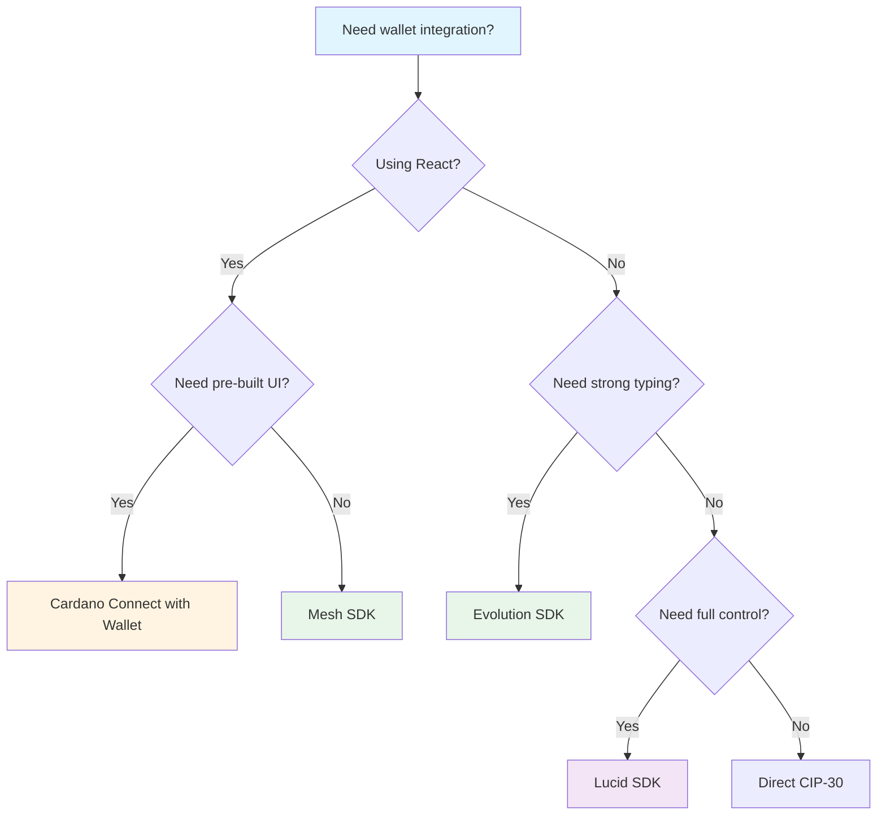

# Wallet Integration Resources

Comprehensive collection of tools, libraries, and documentation for integrating Cardano wallets into your dApps.

## Quick Reference: Wallet Integration Libraries

### Library Comparison Matrix

| Library | Framework | Wallet Support | Best For | Language |
|---------|-----------|----------------|----------|----------|
| **[Mesh SDK](https://meshjs.dev/)** | React | CIP-30, CIP-95 | Frontend dApps, rapid development | JavaScript/TypeScript |
| **[Evolution SDK](https://github.com/IntersectMBO/evolution-sdk)** | Any | CIP-30, Private Keys, Seeds | Strongly typed, backend/off-chain | JavaScript/TypeScript |
| **[Cardano Connect with Wallet](https://cardano-foundation.github.io/cardano-connect-with-wallet/)** | React | CIP-30 | Official Foundation library, pre-built UI | JavaScript/TypeScript |
| **[Lucid](https://github.com/spacebudz/lucid)** | Any | CIP-30 | Full transaction control | JavaScript/TypeScript |
| **Direct CIP-30** | Any | CIP-30 | Custom implementations | JavaScript |

### Decision Tree



### Quick Start Guides

#### Mesh SDK (5 minutes)

```bash
npm install @meshsdk/react @meshsdk/core
```

```tsx
import { MeshProvider, useWallet } from '@meshsdk/react';

const { connect, wallet, connected } = useWallet();
await connect('eternl');
const addresses = await wallet.getUsedAddresses();
```

**Documentation:** [Mesh Docs](https://meshjs.dev/) | [GitHub](https://github.com/MeshJS/mesh)

#### Evolution SDK (5 minutes)

```bash
npm install @intersectmbo/evolution-sdk
```

```tsx
import { Lucid } from '@intersectmbo/evolution-sdk';

const lucid = await Lucid.new(provider, network);
const walletApi = await window.cardano.eternl.enable();
await lucid.selectWallet.fromAPI(walletApi);
```

**Documentation:** [GitHub](https://github.com/IntersectMBO/evolution-sdk)

#### Cardano Connect with Wallet (5 minutes)

```bash
npm install @cardano-foundation/cardano-connect-with-wallet
```

```tsx
import { useCardano } from '@cardano-foundation/cardano-connect-with-wallet';

const { connect, isConnected } = useCardano();
await connect('eternl');
```

**Documentation:** [Cardano Connect Docs](https://cardano-foundation.github.io/cardano-connect-with-wallet/) | [GitHub](https://github.com/cardano-foundation/cardano-connect-with-wallet)

---

## Available Cardano Wallets

### Browser Extension Wallets

| Wallet | Developer | Features |
|--------|-----------|----------|
| **Nami** | Community | Light wallet, CIP-30 support |
| **Eternl** | Community | Multi-platform, advanced features |
| **Lace** | IOG | Official IOG wallet, dApp connector |
| **Flint** | Community | Browser extension |
| **Typhon** | Community | Browser extension |
| **Yoroi** | Emurgo | Browser & mobile |
| **Gero** | Community | Browser extension |
| **NuFi** | Community | Browser extension |
| **Vespr** | Community | Browser extension |
| **Begin** | Community | Browser extension |

### Full-Node Wallets

- **Daedalus** - Desktop wallet by IOG (requires full blockchain sync)

---

## Wallet Integration Patterns

### 1. Payments & Transactions
Enable users to send ADA or tokens through your dApp.

**Tools:** Mesh SDK, Evolution SDK, Lucid

**Verification Options:**
- Blockfrost API - Third-party transaction querying
- Cardano Node + CLI - Self-hosted verification
- Cardano Wallet API - Programmatic wallet management

### 2. Authentication (CIP-8 / CIP-30)
Use wallet as a login mechanism with cryptographic message signing.

**Use Cases:** Tipping platforms, gated content, decentralized identity

### 3. Wallet-as-a-Service (WaaS)
<abbr title="Custodial wallets are wallets where a third-party service holds and manages the private keys on behalf of the user">Custodial</abbr>/<abbr title="Semi-custodial wallets provide a middle ground where some keys are managed by the service and some by the user">semi-custodial</abbr> solutions for non-technical users.

**Trade-off:** Better UX but introduces centralization

---

## Hands-On Repository

### Cardano Demo Wallet Dashboard

Hands-on project demonstrating wallet connection, balance queries, and transaction management using Mesh SDK.

<a href="https://github.com/danbaruka/cardano-demo-wallet-dashbord" target="_blank" rel="noopener noreferrer">
  
</a>

---

## Standards & Specifications

| Standard | Description | Documentation |
|----------|-------------|--------------|
| **CIP-30** | dApp Connector API standard | [CIP-30 Specification](https://cips.cardano.org/cips/cip30/) |
| **CIP-8** | Message Signing standard | [CIP-8 Specification](https://cips.cardano.org/cips/cip8/) |
| **CIP-95** | Governance features | [CIP-95 Specification](https://cips.cardano.org/cips/cip95/) |

---

## Documentation & Resources

### Official Documentation

- **[Cardano Developer Portal](https://developers.cardano.org/)** - Central hub for Cardano documentation and guides
- **[Cardano Docs](https://docs.cardano.org/)** - Official Cardano documentation

### Library Documentation

- **[Mesh SDK Documentation](https://meshjs.dev/)** - Complete guide to Mesh SDK wallet integration
- **[Evolution SDK GitHub](https://github.com/IntersectMBO/evolution-sdk)** - Evolution SDK repository and documentation
- **[Cardano Connect with Wallet](https://cardano-foundation.github.io/cardano-connect-with-wallet/)** - Official Foundation library documentation
- **[Lucid GitHub](https://github.com/spacebudz/lucid)** - Lucid SDK repository and documentation

### Additional Resources

- **[CIPs Repository](https://cips.cardano.org/)** - All Cardano Improvement Proposals
- **[Cardano Serialization Library](https://github.com/Emurgo/cardano-serialization-lib)** - Low-level library for transaction building

---

## Related Session Materials

- **[Session Notes](../session-notes/readme.md)** - Complete wallet integration guide
- **[Session Recordings](../recordings/readme.md)** - Video recordings

---

*Referenced by the Q1 2026 Developer Experience Working Group session "Wallet Integration & Developer Experience".*
