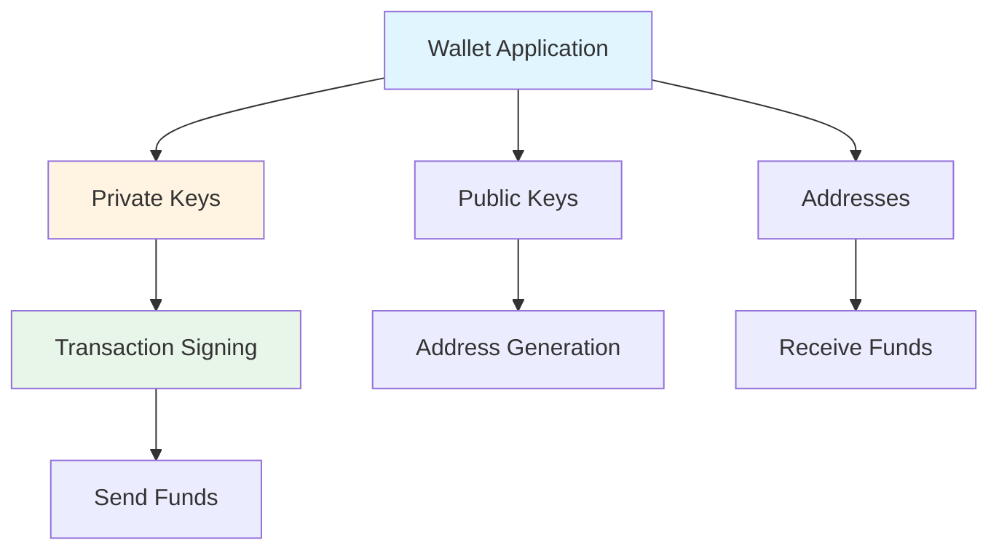

# Wallet Integration & Developer Experience

This session explores wallet integration patterns for Cardano dApps and practical approaches to connecting wallets in decentralized applications.

**What you'll learn:**
- Three core wallet integration patterns: Payments, Authentication, and Wallet-as-a-Service
- Recommended tools and SDKs for wallet integration
- Best practices for implementing wallet connections

---

## What is a Wallet?

A **Cardano wallet** is a software application that enables users to manage their digital assets on the Cardano blockchain. Wallets provide the interface and tools needed to interact with the blockchain securely.

### Core Functions

Wallets perform several essential functions:

| Function | Description |
|----------|-------------|
| **Key Management** | Securely store and manage cryptographic keys (private keys never leave the wallet) |
| **Address Generation** | Create and manage Cardano addresses for receiving funds |
| **Transaction Signing** | Cryptographically sign transactions using private keys |
| **Balance Tracking** | Query and display ADA and native token balances |
| **dApp Interaction** | Connect to decentralized applications via CIP-30 standard |

### Important Concepts

**Wallets Don't Store Funds:**
- Wallets don't actually store your ADA or tokens
- Funds exist on the blockchain in UTXOs (Unspent Transaction Outputs)
- Wallets manage the keys that control access to those funds
- Your funds are safe as long as you control the private keys

**Key Components:**



**Types of Wallets:**

- **Full-Node Wallets**: Download and sync the entire blockchain (e.g., Daedalus)
- **Light Wallets**: Connect to remote servers for blockchain data (e.g., browser extensions)
- **Hardware Wallets**: Physical devices that store keys offline
- **CLI Wallets**: Command-line tools for programmatic wallet management

### Wallet Standards

Cardano wallets follow standardized protocols for dApp integration:

- **CIP-30**: dApp Connector API standard for wallet communication
- **CIP-8**: Message Signing standard for authentication
- **CIP-95**: Governance features for voting and participation

These standards ensure compatibility between wallets and dApps across the Cardano ecosystem.

---

## Wallet Integration Patterns

There are three primary patterns for integrating wallets into Cardano dApps, each serving different use cases and user needs.

### Pattern 1: Payments & Transactions

The most common integration pattern—enabling users to send and receive ADA or native tokens through your dApp.

**Use Cases:**
- E-commerce and payment processing
- Token transfers and swaps
- Subscription services
- Donation platforms

**Implementation Flow:**


**Recommended Tools:**

| Tool | Type | Best For |
|------|------|----------|
| **Mesh SDK** | React Library | Frontend dApps, rapid development |
| **Evolution SDK** | TypeScript Library | Strongly typed, backend integration |
| **Lucid** | TypeScript Library | Full transaction control |

**Verification Options:**

- **Blockfrost API**: Third-party service for easy transaction querying and verification
- **Cardano Node + CLI**: Self-hosted solution for complete sovereignty
- **Cardano Wallet API**: Programmatic wallet management and verification

### Pattern 2: Authentication (CIP-8 / CIP-30)

Using a wallet as a cryptographic login mechanism, replacing traditional email/password authentication.

**How It Works:**

1. User connects wallet to dApp
2. dApp requests message signature
3. User signs message with wallet's private key
4. Backend verifies signature against user's public address
5. Authentication granted based on signature validity

**Use Cases:**
- Tipping platforms and social networks
- Gated content and premium features
- Decentralized identity systems
- Web3 gaming and metaverse platforms

**Advantages:**
- ✅ No password management
- ✅ Cryptographic proof of ownership
- ✅ Cross-platform compatibility
- ✅ Enhanced security

**Standards:**
- **CIP-30**: dApp Connector API for wallet communication
- **CIP-8**: Message Signing standard for authentication

### Pattern 3: Wallet-as-a-Service (WaaS)

Custodial or semi-custodial wallet solutions for applications targeting non-technical users who prefer not to manage seed phrases.

**How It Works:**

Applications manage cryptographic keys securely on behalf of users, providing a seamless experience without requiring users to understand wallet mechanics.

**Trade-offs:**

| Aspect | Traditional Wallets | WaaS |
|--------|-------------------|------|
| **User Control** | Full control of keys | Managed by service |
| **UX Friction** | Higher (seed phrases, backups) | Lower (email-like signup) |
| **Security Model** | User responsibility | Service responsibility |
| **Centralization** | Decentralized | Centralized/Semi-custodial |
| **Cost** | Free | Service fees may apply |

**When to Use:**
- Targeting mainstream, non-crypto users
- Applications requiring simplified onboarding
- Enterprise solutions with compliance needs
- Applications where UX is prioritized over decentralization

---

## Integration Libraries

### Mesh SDK

React-focused library with hooks and components for rapid wallet integration.

**Features:**
- React hooks (`useWallet`, `useWalletList`)
- Pre-built UI components
- CIP-30 and CIP-95 support
- Comprehensive documentation

**Installation:**
```bash
npm install @meshsdk/react @meshsdk/core
```

**Best For:** Frontend dApps, React applications, rapid prototyping

### Evolution SDK

Strongly typed TypeScript library for wallet integration with flexible wallet selection methods.

**Features:**
- Multiple wallet selection methods (CIP-30, private keys, seed phrases)
- Strong TypeScript typing
- Backend and frontend support
- Transaction building utilities

**Installation:**
```bash
npm install @intersectmbo/evolution-sdk
```

**Best For:** TypeScript projects, backend integration, production applications

### Cardano Connect with Wallet

Official Cardano Foundation library providing React hooks and pre-built UI components.

**Features:**
- Official Foundation support
- Pre-built wallet selection UI
- React hooks for wallet state
- Next.js SSR support

**Installation:**
```bash
npm install @cardano-foundation/cardano-connect-with-wallet
```

**Best For:** Official integrations, React applications, quick UI setup

---

## Available Cardano Wallets

### Browser Extension Wallets

| Wallet | Developer | Network Support | CIP-30 |
|--------|-----------|----------------|--------|
| **Nami** | Community | Mainnet, Testnet | ✅ |
| **Eternl** | Community | Mainnet, Testnet | ✅ |
| **Lace** | IOG | Mainnet, Testnet | ✅ |
| **Flint** | Community | Mainnet, Testnet | ✅ |
| **Typhon** | Community | Mainnet, Testnet | ✅ |
| **Yoroi** | Emurgo | Mainnet, Testnet | ✅ |
| **Gero** | Community | Mainnet, Testnet | ✅ |
| **NuFi** | Community | Mainnet, Testnet | ✅ |
| **Vespr** | Community | Mainnet, Testnet | ✅ |
| **Begin** | Community | Mainnet, Testnet | ✅ |

### Full-Node Wallets

- **Daedalus**: Desktop wallet by IOG requiring full blockchain synchronization

---

## Best Practices

### Network Validation

Always verify the wallet is connected to the correct network (mainnet vs testnet) before proceeding with transactions.

```typescript
const networkId = await wallet.getNetworkId();
// 0 = testnet, 1 = mainnet
if (networkId !== expectedNetwork) {
  throw new Error('Please switch to the correct network');
}
```

### Address Validation

Validate address format matches the expected network prefix.

```typescript
const validateAddress = (address: string, network: 'mainnet' | 'testnet') => {
  const prefix = network === 'mainnet' ? 'addr1' : 'addr_test1';
  return address.startsWith(prefix);
};
```

### Error Handling

Implement comprehensive error handling for:
- User rejection of connection requests
- Missing wallet extensions
- Network mismatches
- Transaction failures

### Session Management

Persist connection state to improve user experience:

```typescript
// Save connection state
localStorage.setItem('walletName', walletName);
localStorage.setItem('walletConnected', 'true');

// Restore on page load
const savedWallet = localStorage.getItem('walletName');
if (savedWallet) {
  await connect(savedWallet);
}
```

---

*This guide is part of the Q1 2026 Developer Experience Working Group session on Wallet Integration & Developer Experience.*

For comprehensive resources, tools, and documentation links, see the [Session Resources](../session-resources/readme.md) page.
