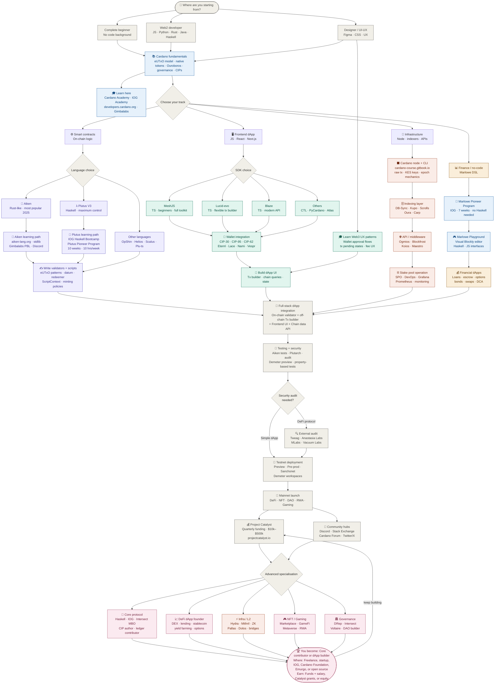
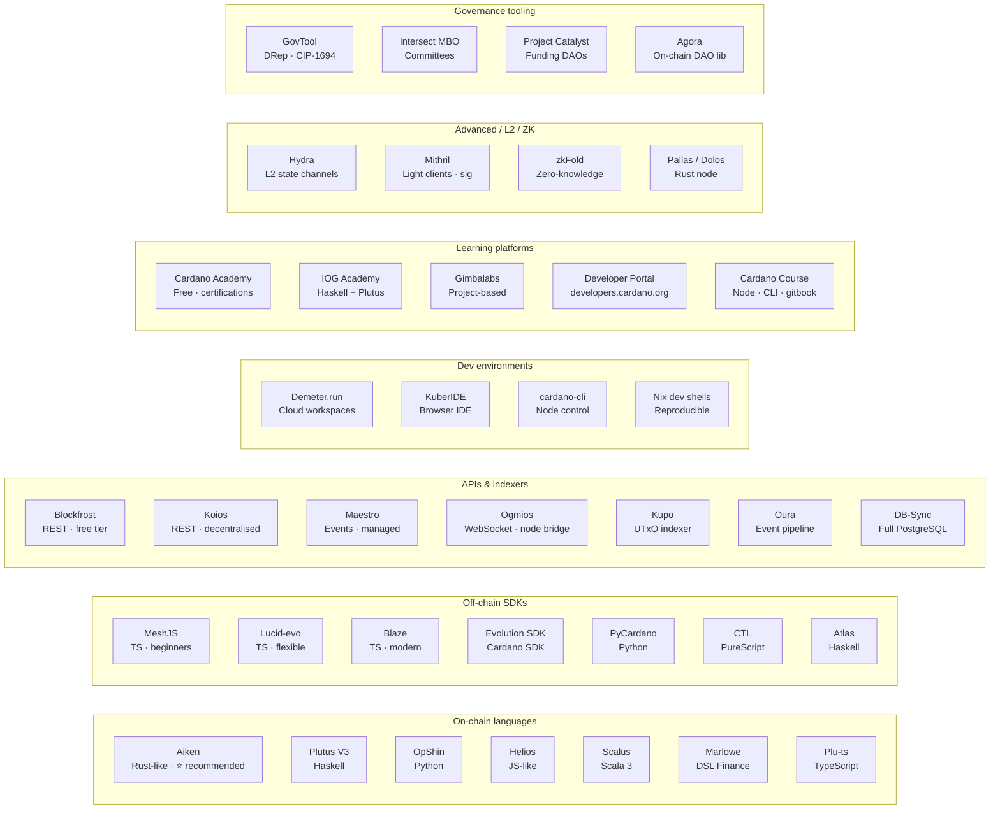
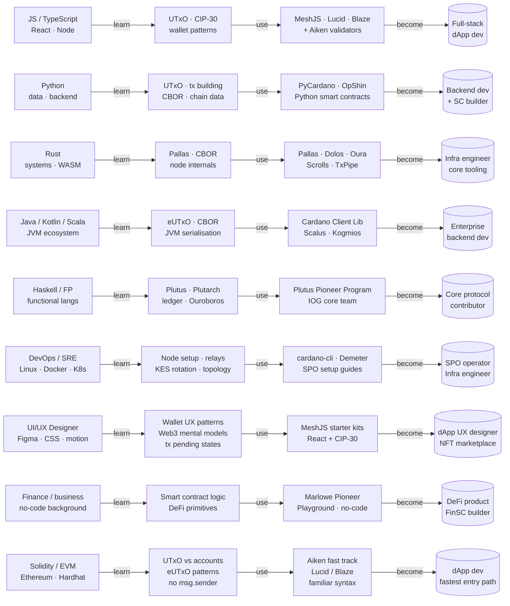
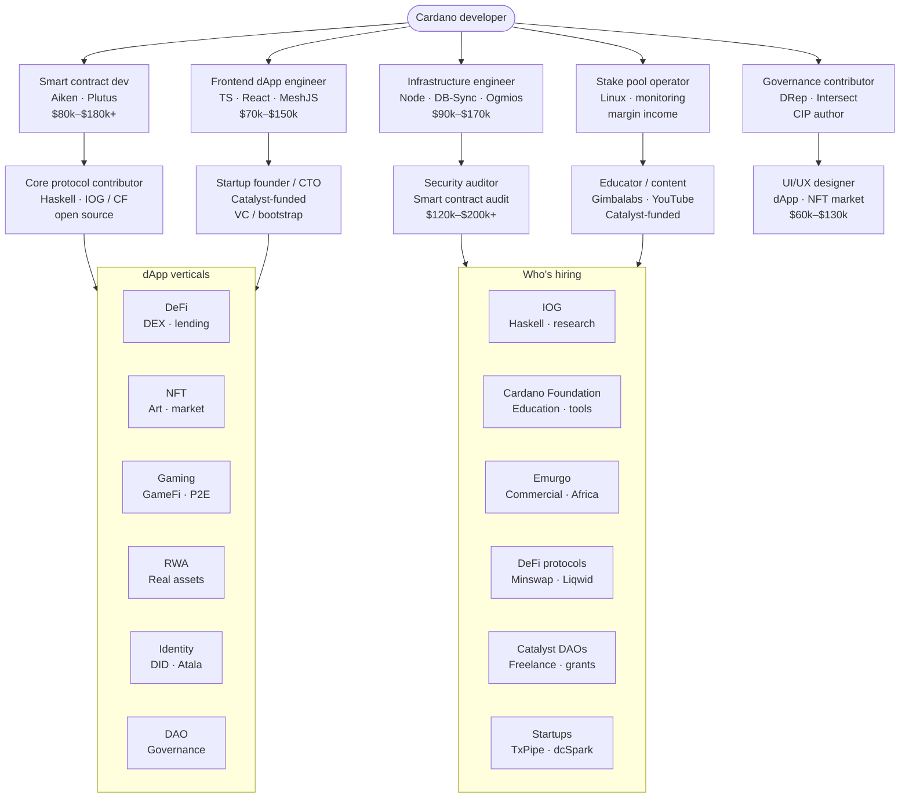

# Cardano Developer Pathway

## From Zero to Core Contributor or dApp Builder - All Possibilities

The diagrams below show the full pathway and companion views. For the full explication, see [Resources](../session-resources/readme.md).

---

### Full pathway diagram

---

### Tools and platforms reference

---

### Web2 to Web3 transition paths

---

### Career outcomes

For the full explication (entry profiles, tracks, tools, careers, Web2 to Web3, and more), see [Resources](../session-resources/readme.md).

