import CardanoToolGrid from '@site/src/components/CardanoToolGrid';

# Cardano Developer Pathway

## From Zero to Core Contributor or dApp Builder

This page is a **single interactive map** of the Cardano developer journey. **Hover** nodes for tooltips, **click** nodes to open docs (new tab). It incorporates the [Session 12 DX audit themes](https://github.com/IntersectMBO/developer-experience/issues/200): local devnets, transaction anatomy, concurrency, debugging, hosted APIs, NFT standards, EVM migration, governance, L2, and cross-chain—without splitting content across many files.

Use the **tool grid** under the diagram to explore each product in depth. For tables and quick reference, see [Resources](../session-resources/readme.md).

---

## Full Pathway Diagram

```mermaid
flowchart TD
  subgraph orient [Orientation]
    start([Where are you starting])
    beginner[Complete beginner no code yet]
    web2[Web2 developer JS Python Rust Java and more]
    designer[Designer UI-UX Figma CSS motion]
    start --> beginner
    start --> web2
    start --> designer
    beginner --> fund
    web2 --> fund
    designer --> fund
    fund["Cardano fundamentals eUTxO native tokens Ouroboros Voltaire CIPs"]
    fund --> learnHere["Learn here Academy developers.cardano.org Gimbalabs cardano-course"]
  end

  subgraph crossCut [Cross-cutting knowledge]
    stack2026["Default stack for most new builds in 2026 Aiken plus MeshJS plus Blockfrost swap Lucid Blaze Koios when needed"]
    noFullNode["You do not need a synced full node for many dApps use Blockfrost Koios or Maestro"]
    cborNote["CBOR appears in txs datums redeemers and addresses essential for low-level debugging"]
    cipPick["Essential CIPs to prioritize CIP-30 wallet CIP-25 27 31 assets CIP-33 reference scripts CIP-68 metadata CIP-1694 governance"]
  end

  learnHere --> stack2026
  learnHere --> noFullNode
  fund --> cborNote
  fund --> cipPick

  subgraph ramp [Intermediate ramp first shipped projects]
    rampVm[Vending machine or similar single-purpose contract]
    rampNft[NFT minter native assets CIP-25 CIP-67 labels CIP-68]
    rampDex[Simple DEX or swap lesson hits UTxO concurrency]
    rampFull[Full stack dApp validator plus SDK plus UI plus APIs]
    rampVm --> rampNft --> rampDex --> rampFull
  end

  learnHere --> rampVm
  stack2026 --> pickTrack

  web2 --> evmEntry[Solidity or EVM background]
  evmEntry --> evmMap["EVM to Cardano map accounts vs UTxO no msg.sender ExUnits vs gas find Aiken OpenZeppelin-style libs in ecosystem guides"]
  evmMap --> pickTrack

  rampFull --> pickTrack
  cipPick --> pickTrack

  pickTrack{Choose primary track}

  pickTrack --> trackSc[Smart contracts on-chain logic]
  pickTrack --> trackFe[Frontend dApp JS React Next]
  pickTrack --> trackInfra[Infrastructure node indexers APIs SPO]
  pickTrack --> trackMarlowe[Marlowe financial DSL]

  trackSc --> langPick{On-chain language}

  langPick --> aikenLang[Aiken Rust-like ecosystem default]
  langPick --> plutusLang[Plutus Haskell core]
  langPick --> otherLang[OpShin Helios Scalus Plu-ts]

  aikenLang --> aikenLearn[Aiken docs stdlib tests Discord]
  plutusLang --> plutusLearn[Plutus Pioneer IOG Haskell path]
  otherLang --> localDevnet

  aikenLearn --> localDevnet
  plutusLearn --> localDevnet

  localDevnet["Local devnet fast feedback Yaci DevKit cardano-testnet or Ogmios plus Kupo before testnet round-trips"]
  localDevnet --> scBuild["Validators scripts datum redeemer minting policies"]

  trackFe --> sdkPick{Off-chain SDK}

  sdkPick --> meshSdk[MeshJS]
  sdkPick --> lucidSdk[Lucid evolution]
  sdkPick --> blazeSdk[Blaze typed TS]
  sdkPick --> otherSdk[PyCardano CTL Atlas Evolution SDK]

  meshSdk --> txAnatomy
  lucidSdk --> txAnatomy
  blazeSdk --> txAnatomy
  otherSdk --> txAnatomy

  txAnatomy["Transaction anatomy minUTxO collateral ExUnits coin selection linear fees reference scripts CIP-33"]

  txAnatomy --> walletInt["Wallet integration CIP-30 dApp connector CIP-95 governance CIP-62 mobile hardware light vs full node wallets errors user reject and balance"]

  walletInt --> feBuild["dApp UI tx building chain queries state UX"]

  trackInfra --> nodeCli[Cardano node and cardano-cli]
  nodeCli --> indexerLayer[DB-Sync Kupo Scrolls Oura Dolos]
  indexerLayer --> apiLayer[Ogmios Blockfrost Koios Maestro]
  apiLayer --> spoPath[Stake pool operations DevOps monitoring]

  noFullNode -.-> apiLayer

  trackMarlowe --> marloweNote["Marlowe Playground and DSL check current IOG education pages program availability and runtime maintenance before long commitments"]
  marloweNote --> marlowePlay[Marlowe Playground visual flows]
  marlowePlay --> marloweShip[Financial products loans escrow bonds]

  designer --> uxLearn[Web3 UX wallet flows pending txs fees]
  uxLearn --> walletInt

  scBuild --> integrateFull
  feBuild --> integrateFull
  spoPath --> integrateFull
  marloweShip --> integrateFull

  integrateFull["Full-stack integration on-chain plus off-chain plus UI plus chain data"]

  integrateFull --> utxoConcurrency["UTxO concurrency patterns batching state threads beacons fan-in fan-out avoid single hot UTxO"]

  utxoConcurrency --> testDebug["Testing plus on-chain debug property tests integration Aiken tests cardano-cli transaction evaluate script traces Aiken tracing ExUnits overruns"]

  testDebug --> auditGate{External audit needed}

  auditGate -->|DeFi or high value| auditFirm[Tweag Anastasia MLabs Vacuum and peers]
  auditGate -->|Simple dApp| shipTestnet

  auditFirm --> shipTestnet

  shipTestnet["Testnets Preview Preprod Sanchonet faucets env-specific SDK config see testnet docs"]

  shipTestnet --> mainnetShip[Mainnet launch DeFi NFT DAO RWA gaming]

  mainnetShip --> catalyst[Project Catalyst grants]
  mainnetShip --> community[Discord Stack Exchange Forum hubs]

  catalyst --> growPick{Advanced specialisation}
  community --> growPick

  growPick --> corePath[Core protocol Haskell ledger CIPs cardano-node]
  growPick --> defiPath[DeFi founder DEX lending stablecoins]
  growPick --> l2Path[Hydra head Mithril snapshots zk and rollup research]
  growPick --> nftPath[NFT gaming marketplaces RWA]
  growPick --> govPath[GovTool DRep Agora Voltaire DAO primitives CIP-1694]
  growPick --> bridgePath[Cross-chain bridges wrapped assets ecosystem bridges overview]

  corePath --> outcomes
  defiPath --> outcomes
  l2Path --> outcomes
  nftPath --> outcomes
  govPath --> outcomes
  bridgePath --> outcomes

  outcomes["Outcomes core contributor or dApp builder salary grants equity open source portfolio Catalyst meetups"]

  outcomes -->|Keep shipping| catalyst

  click start "/docs/working-group/sessions/q1-2026/12-cardano-developer-pathway/session-resources/readme"
  click fund "https://developers.cardano.org/docs/get-started/"
  click learnHere "https://academy.cardanofoundation.org"
  click stack2026 "/docs/working-group/sessions/q1-2026/12-cardano-developer-pathway/session-resources/readme"
  click noFullNode "https://blockfrost.io"
  click cborNote "https://developers.cardano.org/docs/get-started/"
  click cipPick "https://github.com/cardano-foundation/CIPs"
  click rampVm "https://aiken-lang.org/language-tour/validators"
  click rampNft "https://developers.cardano.org/docs/native-tokens/"
  click rampDex "https://developers.cardano.org/docs/smart-contracts/"
  click rampFull "https://developers.cardano.org/docs/get-started/"
  click evmMap "https://aiken-lang.org"
  click aikenLang "https://aiken-lang.org"
  click plutusLang "https://plutus.readthedocs.io"
  click otherLang "https://developers.cardano.org/docs/smart-contracts/"
  click aikenLearn "https://aiken-lang.org/installation-instructions"
  click plutusLearn "https://iog.io/en/education/programs/plutus-pioneers-program/"
  click localDevnet "https://github.com/bloxbean/yaci-devkit"
  click scBuild "https://aiken-lang.org/language-tour/validators"
  click meshSdk "https://meshjs.dev"
  click lucidSdk "https://lucid-evolution.netlify.app"
  click blazeSdk "https://blaze.butane.dev"
  click otherSdk "https://developers.cardano.org/docs/get-started/"
  click txAnatomy "https://developers.cardano.org/docs/get-started/"
  click walletInt "https://github.com/cardano-foundation/CIPs/tree/master/CIP-0030"
  click feBuild "https://developers.cardano.org/docs/get-started/"
  click nodeCli "https://cardano-course.gitbook.io"
  click indexerLayer "https://github.com/IntersectMBO/cardano-db-sync"
  click apiLayer "https://koios.rest"
  click spoPath "https://developers.cardano.org/docs/operate-a-stake-pool/"
  click marloweNote "https://iog.io/en/education/"
  click marlowePlay "https://play.marlowe.iohk.io"
  click marloweShip "https://marlowe.iohk.io"
  click uxLearn "https://developers.cardano.org/docs/get-started/"
  click integrateFull "https://developers.cardano.org/docs/get-started/"
  click utxoConcurrency "https://cardano.stackexchange.com"
  click testDebug "https://aiken-lang.org/language-tour/tests"
  click auditFirm "https://developers.cardano.org/docs/smart-contracts/"
  click shipTestnet "https://docs.cardano.org/cardano-testnets/getting-started/"
  click mainnetShip "https://developers.cardano.org/showcase"
  click catalyst "https://projectcatalyst.io"
  click community "https://cardano.stackexchange.com"
  click corePath "https://github.com/intersectmbo/cardano-node"
  click defiPath "https://developers.cardano.org/docs/smart-contracts/"
  click l2Path "https://hydra.family"
  click nftPath "https://developers.cardano.org/docs/native-tokens/"
  click govPath "https://gov.tools"
  click bridgePath "https://developers.cardano.org/docs/get-started/"
  click outcomes "https://developers.cardano.org/showcase"
```

<CardanoToolGrid label="Explore tools APIs languages and learning platforms in detail" />

---

For the written explainer with entry profiles, tables, and quick-reference timelines, see [Resources](../session-resources/readme.md).
