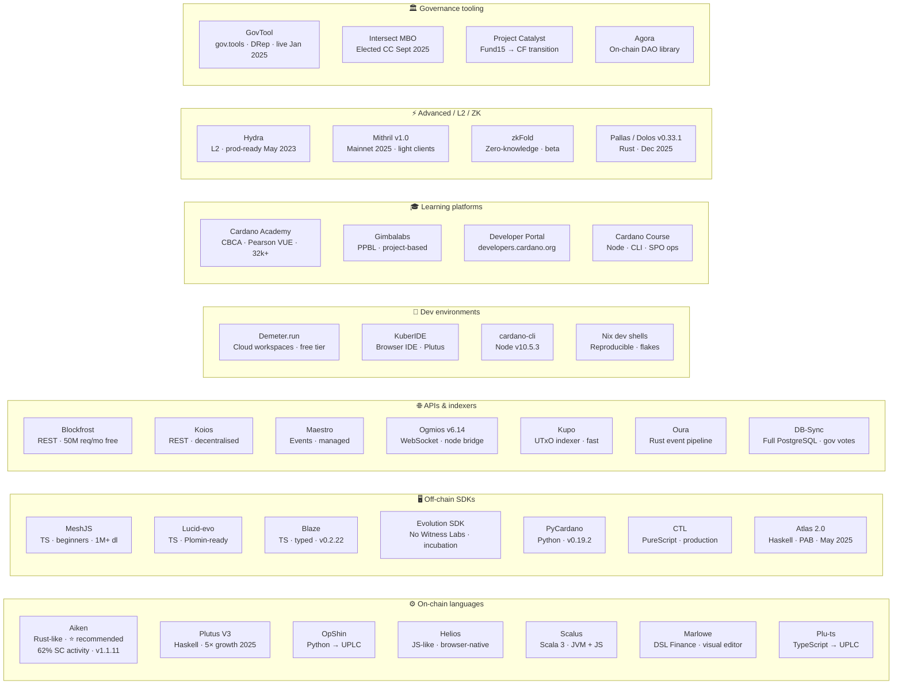
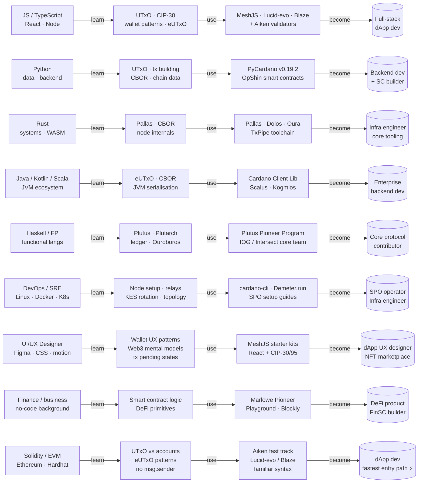
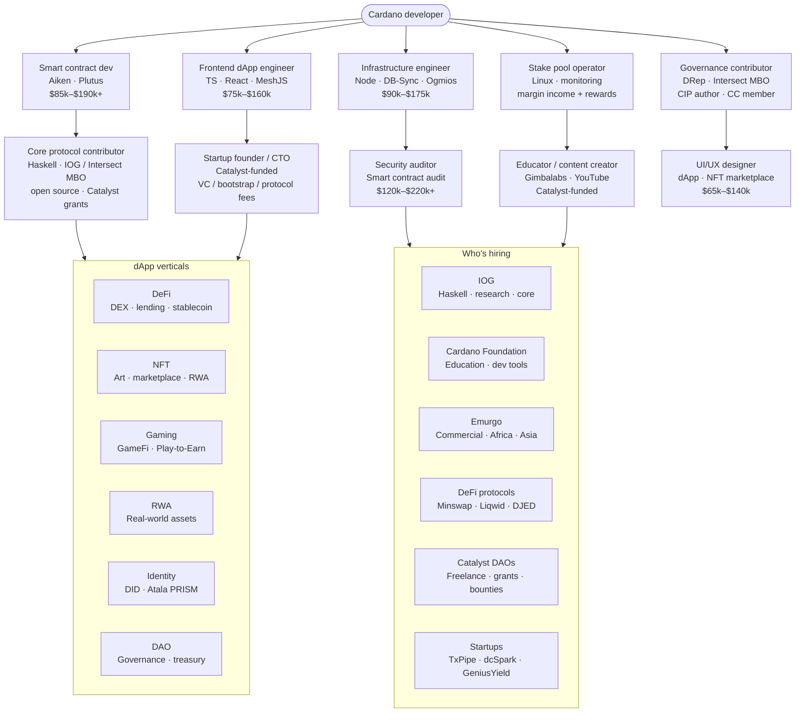

import CardanoToolGrid from '@site/src/components/CardanoToolGrid';

# Cardano Developer Pathway

## From Zero to Core Contributor or dApp Builder

The diagrams below are fully interactive **hover any node** to see a tooltip, **click any node** to open its documentation in a new tab. The interactive reference grids below each diagram let you explore all tools in detail.

For the full written explainer, see [Resources](../session-resources/readme.md).

---

## Full Pathway Diagram

```mermaid
flowchart TD
    START([🚀 Where are you starting from?])

    START --> BEGINNER[Complete beginner<br/>No code background]
    START --> WEB2[Web2 developer<br/>JS · Python · Rust · Java · Haskell]
    START --> DESIGNER[Designer / UI-UX<br/>Figma · CSS · UX]

    BEGINNER --> FUNDAMENTALS
    WEB2 --> FUNDAMENTALS
    DESIGNER --> FUNDAMENTALS

    FUNDAMENTALS["📚 Cardano fundamentals<br/>eUTxO model · native tokens · Ouroboros · Voltaire governance · CIPs"]

    FUNDAMENTALS --> LEARN_FUND["🎓 Learn here<br/>Cardano Academy · developers.cardano.org<br/>Gimbalabs · cardano-course.gitbook.io"]

    FUNDAMENTALS --> CHOOSE{Choose your track}

    CHOOSE --> TRACK_SC["⚙️ Smart contracts<br/>On-chain logic"]
    CHOOSE --> TRACK_FE["🖥️ Frontend dApp<br/>JS · React · Next.js"]
    CHOOSE --> TRACK_INFRA["🔧 Infrastructure<br/>Node · indexers · APIs"]
    CHOOSE --> TRACK_MARLOWE["📊 Finance / no-code<br/>Marlowe DSL"]

    TRACK_SC --> LANG_CHOICE{Language choice}

    LANG_CHOICE --> AIKEN["🦀 Aiken<br/>Rust-like · 62% SC activity · v1.1.11"]
    LANG_CHOICE --> PLUTUS["λ Plutus V3<br/>Haskell · 5× growth 2025"]
    LANG_CHOICE --> OTHERS_SC["Other languages<br/>OpShin · Helios · Scalus · Plu-ts"]

    AIKEN --> AIKEN_LEARN["📖 Aiken learning path<br/>aiken-lang.org · stdlib<br/>Gimbalabs PPBL · Discord"]
    PLUTUS --> PLUTUS_LEARN["📖 Plutus learning path<br/>IOG Haskell Bootcamp<br/>Plutus Pioneer Program<br/>10 weeks · 10 hrs/week"]

    AIKEN_LEARN --> SC_BUILD
    PLUTUS_LEARN --> SC_BUILD
    OTHERS_SC --> SC_BUILD

    SC_BUILD["✍️ Write validators + scripts<br/>eUTxO patterns · datum · redeemer<br/>ScriptContext · minting policies"]

    TRACK_FE --> SDK_CHOICE{SDK choice}

    SDK_CHOICE --> MESHJS["MeshJS<br/>TS · beginners · full toolkit"]
    SDK_CHOICE --> LUCID["Lucid-evo<br/>TS · Anastasia Labs · Plomin-ready"]
    SDK_CHOICE --> BLAZE["Blaze<br/>TS · strongly typed · v0.2.22"]
    SDK_CHOICE --> OTHER_SDK["Others<br/>CTL · PyCardano · Atlas · Evolution SDK"]

    MESHJS --> WALLET_INT
    LUCID --> WALLET_INT
    BLAZE --> WALLET_INT
    OTHER_SDK --> WALLET_INT

    WALLET_INT["🔗 Wallet integration<br/>CIP-30 · CIP-95 · CIP-62<br/>Eternl · Lace · Nami · Vespr"]
    WALLET_INT --> FE_BUILD["🎨 Build dApp UI<br/>Tx builder · chain queries · state"]

    TRACK_INFRA --> NODE["⬛ Cardano node + CLI<br/>v10.5.3 · cardano-course.gitbook.io<br/>raw tx · KES keys · epoch mechanics"]

    NODE --> INDEXER["🗄️ Indexing layer<br/>DB-Sync · Kupo · Scrolls<br/>Oura · Dolos v0.33.1"]
    INDEXER --> API_LAYER["🌐 API / middleware<br/>Ogmios v6.14 · Blockfrost<br/>Koios · Maestro"]
    API_LAYER --> SPO["⛓️ Stake pool operation<br/>SPO · DevOps · Grafana<br/>Prometheus · monitoring"]

    TRACK_MARLOWE --> MARLOWE_LEARN["📖 Marlowe Pioneer Program<br/>IOG · 7 weeks · no Haskell needed"]
    MARLOWE_LEARN --> MARLOWE_PLAY["🎮 Marlowe Playground<br/>Visual Blockly editor<br/>Haskell · JS interfaces"]
    MARLOWE_PLAY --> MARLOWE_BUILD["💰 Financial dApps<br/>Loans · escrow · options<br/>bonds · swaps · DCA"]

    DESIGNER --> UX_LEARN["🎓 Learn Web3 UX patterns<br/>Wallet approval flows<br/>tx pending states · fee UX"]
    UX_LEARN --> FE_BUILD

    SC_BUILD --> FULLSTACK
    FE_BUILD --> FULLSTACK
    SPO --> FULLSTACK
    MARLOWE_BUILD --> FULLSTACK

    FULLSTACK["🔄 Full-stack dApp integration<br/>On-chain validator + off-chain Tx builder<br/>+ Frontend UI + Chain data API"]

    FULLSTACK --> TESTING["🧪 Testing + security<br/>Aiken tests · Plutarch · audit<br/>Demeter preview · property-based tests"]

    TESTING --> AUDIT{"Security audit<br/>needed?"}
    AUDIT -->|DeFi protocol| AUDIT_FIRM["🔍 External audit<br/>Tweag · Anastasia Labs<br/>MLabs · Vacuum Labs"]
    AUDIT -->|Simple dApp| TESTNET

    AUDIT_FIRM --> TESTNET

    TESTNET["🧪 Testnet deployment<br/>Preview · Pre-prod · Sanchonet<br/>Demeter workspaces · free tier"]
    TESTNET --> MAINNET["🚀 Mainnet launch<br/>DeFi · NFT · DAO · RWA · Gaming"]

    MAINNET --> CATALYST["💰 Project Catalyst<br/>Fund15 · transitioning to CF<br/>projectcatalyst.io"]
    MAINNET --> COMMUNITY["👥 Community hubs<br/>Discord · Stack Exchange<br/>Cardano Forum · Twitter/X"]

    CATALYST --> ADVANCED
    COMMUNITY --> ADVANCED

    ADVANCED{Advanced specialisation}

    ADVANCED --> CORE["🧬 Core protocol<br/>Haskell · IOG · Intersect MBO<br/>CIP author · ledger contributor"]
    ADVANCED --> DEFI["📈 DeFi dApp founder<br/>DEX · lending · stablecoin<br/>yield farming · options"]
    ADVANCED --> INFRA_ADV["⚡ Infra / L2<br/>Hydra (prod-ready) · Mithril v1.0<br/>Pallas · Dolos · zkFold"]
    ADVANCED --> NFT_GAME["🎮 NFT / Gaming<br/>Marketplace · GameFi<br/>Metaverse · RWA"]
    ADVANCED --> GOV["🏛️ Governance<br/>DRep · Intersect MBO<br/>Voltaire · DAO builder · gov.tools"]

    CORE --> OUTCOME
    DEFI --> OUTCOME
    INFRA_ADV --> OUTCOME
    NFT_GAME --> OUTCOME
    GOV --> OUTCOME

    OUTCOME["🏆 Outcome : <br/>1. Core contributor or dApp builder<br/><br/>2. Freelance startups<br/>Cardano Foundation · Emurgo · open source<br/><br/>2. Salary · Catalyst grants · equity · protocol fees"]

    OUTCOME -->|keep building| CATALYST

    click START "/docs/working-group/sessions/q1-2026/12-cardano-developer-pathway/session-resources/readme"
    click FUNDAMENTALS "https://developers.cardano.org/docs/get-started/"
    click LEARN_FUND "https://academy.cardanofoundation.org"
    click AIKEN "https://aiken-lang.org"
    click PLUTUS "https://plutus.readthedocs.io"
    click OTHERS_SC "https://developers.cardano.org/docs/smart-contracts/"
    click AIKEN_LEARN "https://aiken-lang.org/installation-instructions"
    click PLUTUS_LEARN "https://iog.io/en/education/programs/plutus-pioneers-program/"
    click SC_BUILD "https://aiken-lang.org/language-tour/validators"
    click MESHJS "https://meshjs.dev"
    click LUCID "https://lucid-evolution.netlify.app"
    click BLAZE "https://blaze.butane.dev"
    click OTHER_SDK "https://developers.cardano.org/docs/get-started/"
    click WALLET_INT "https://github.com/cardano-foundation/CIPs/tree/master/CIP-0030"
    click FE_BUILD "https://developers.cardano.org/docs/get-started/"
    click NODE "https://cardano-course.gitbook.io"
    click INDEXER "https://github.com/IntersectMBO/cardano-db-sync"
    click API_LAYER "https://blockfrost.io"
    click SPO "https://developers.cardano.org/docs/operate-a-stake-pool/"
    click MARLOWE_LEARN "https://iog.io/en/education/programs/marlowe-pioneers/"
    click MARLOWE_PLAY "https://play.marlowe.iohk.io"
    click MARLOWE_BUILD "https://marlowe.iohk.io"
    click UX_LEARN "https://developers.cardano.org/docs/get-started/"
    click FULLSTACK "https://developers.cardano.org/docs/get-started/"
    click TESTING "https://aiken-lang.org/language-tour/tests"
    click AUDIT_FIRM "https://developers.cardano.org/docs/smart-contracts/"
    click TESTNET "https://docs.cardano.org/cardano-testnets/getting-started/"
    click MAINNET "https://developers.cardano.org/showcase"
    click CATALYST "https://projectcatalyst.io"
    click COMMUNITY "https://cardano.stackexchange.com"
    click CORE "https://github.com/intersectmbo/cardano-node"
    click DEFI "https://developers.cardano.org/docs/smart-contracts/"
    click INFRA_ADV "https://hydra.family"
    click NFT_GAME "https://developers.cardano.org/docs/native-tokens/"
    click GOV "https://gov.tools"
    click OUTCOME "https://developers.cardano.org/showcase"
    classDef sc fill:#EEF2FF,stroke:#4C51BF,stroke-width:2.2px,color:#2B2F77
    classDef fe fill:#E6F8F0,stroke:#0F7A5D,stroke-width:2.2px,color:#07543F
    classDef infra fill:#FFF1EB,stroke:#A84420,stroke-width:2.2px,color:#7A2E14
    classDef learn fill:#E8F4FF,stroke:#2555fe,stroke-width:2.2px,color:#13497D
    classDef marlowe fill:#FFF3E1,stroke:#976014,stroke-width:2.2px,color:#6B4207
    classDef outcome fill:#FFEAF1,stroke:#AD3F65,stroke-width:2.2px,color:#7F2948
    classDef neutral fill:#F7F8FB,stroke:#5A6475,stroke-width:2px,color:#2D3440
    classDef decision fill:#F1F5F9,stroke:#63748A,stroke-width:2.2px,color:#1F2937
    classDef primary fill:#2555fe,stroke:#1a43d4,stroke-width:2.2px,color:#ffffff

    class SC_BUILD,AIKEN,PLUTUS,OTHERS_SC,AIKEN_LEARN,PLUTUS_LEARN,LANG_CHOICE sc
    class FE_BUILD,MESHJS,LUCID,BLAZE,OTHER_SDK,WALLET_INT,SDK_CHOICE,UX_LEARN fe
    class NODE,INDEXER,API_LAYER,SPO,INFRA_ADV infra
    class FUNDAMENTALS,LEARN_FUND,MARLOWE_LEARN,MARLOWE_PLAY learn
    class MARLOWE_BUILD,TRACK_MARLOWE marlowe
    class CORE,DEFI,NFT_GAME,GOV outcome
    class BEGINNER,WEB2,DESIGNER,TRACK_SC,TRACK_FE,TRACK_INFRA,TESTING,TESTNET,MAINNET,COMMUNITY,CATALYST,AUDIT_FIRM neutral
    class CHOOSE,ADVANCED,AUDIT,LANG_CHOICE,SDK_CHOICE decision
    class START,FUNDAMENTALS,FULLSTACK,OUTCOME primary
```

<CardanoToolGrid label="Interactive tool reference click any card to expand details and links" />

---

## Tools and Platforms Reference

<CardanoToolGrid label="Interactive tool cards filter by category · click any card to expand details" />

---

## Web2 to Web3 Transition Paths

<CardanoToolGrid
  categories={['off-chain-sdk', 'on-chain-language', 'dev-environment']}
  label="Recommended tools for Web2 → Web3 transition"
/>

---

## Career Outcomes

<CardanoToolGrid
  categories={['governance', 'layer2-zk', 'learning']}
  label="Advanced tools for specialisation and governance"
/>

---

For the full written explainer entry profiles, tracks, tools, career paths, Web2→Web3 conversion table, and quick-reference timelines see [Resources](../session-resources/readme.md).
