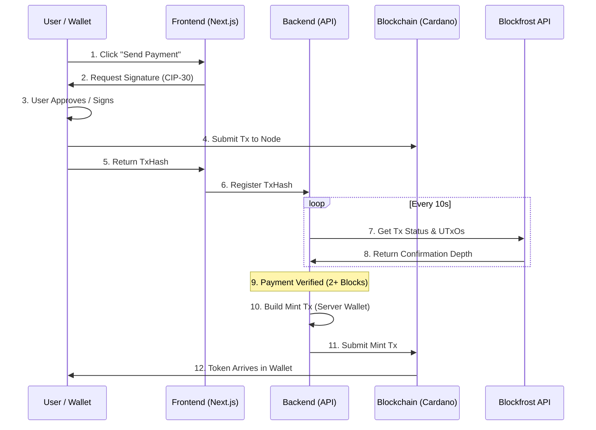

# Session 15: dApp Architecture: From Wallet to Backend - Notes

Notes and architectural breakdown for building full-stack applications on Cardano using Mesh SDK and Blockfrost.

## Overview
Building on Cardano requires a different mental model than traditional "server-centric" applications. In a dApp, the blockchain is the **immutable source of truth**, while the frontend, wallet, and backend act as specialized interfaces to that truth.

---

## 🏗 Sequence Diagram: The Full Flow

The following diagram illustrates the interaction between the four layers during a typical payment-to-mint lifecycle.



---

## 🧩 Deep Dive: The 4 Layers

### 1. User Wallet (The Signing Authority)
The wallet's primary job is **Key Management**. The dApp *never* sees the user's private key.
- **Protocol**: [CIP-30](https://cips.cardano.org/cips/cip30/) defines how the browser talks to the wallet.
- **UX**: Whenever a dApp wants to move funds, the wallet pops up a "Confirm" dialog. This is the ultimate security barrier.

### 2. Frontend (The Orchestrator)
The frontend uses the [Mesh SDK](https://meshjs.dev) to build transactions.
- **Transaction Building**: The SDK gathers UTxOs from the wallet, adds outputs, and calculates fees.
- **State Management**: The frontend must handle the "Waiting" UX, keeping the user informed while the blockchain confirms the transaction.

### 3. Backend (The Verification Engine)
The backend's role is **Trustless Verification**. It must never trust the frontend's claim that "I paid".
- **Verification Logic**: The backend queries Blockfrost for the `txHash` and inspects the **UTxO Outputs**.
- **The Checklist**:
    1. Does the transaction exist on-chain?
    2. Does it have enough confirmations (e.g., 2 for demo, 15+ for production)?
    3. Is there an output to our **App Wallet Address**?
    4. Does that output contain the **correct ADA amount**?

### 4. Blockchain (The Source of Truth)
The Cardano network (Ouroboros) provides the settlement layer.
- **Mempool**: Where transactions live before being included in a block.
- **Propagation**: The time it takes for a transaction to spread across nodes (usually a few seconds).
- **Finality**: As more blocks are added on top of a transaction, it becomes mathematically impossible to reverse.

---

## 🔍 Code Spotlight: Verification Logic

The heart of this architecture lies in how the backend confirms a payment without trusting the user's claimed transaction state. 

### 1. Polling via Blockfrost (poll-status.ts)
The frontend triggers a polling loop every 10 seconds. The backend then performs a "live" check on the blockchain:

```typescript
// pages/api/poll-status.ts snippet
const { confirmed, confirmations, amountLovelace } = await verifyPayment(
  txHash,
  APP_WALLET_ADDRESS
);

if (!confirmed) {
  // If not on-chain or not enough confirmations, keep waiting
  const newStatus = confirmations > 0 ? "CONFIRMING" : "PENDING";
  // ... update local record and return status
}
```

### 2. Identifying the Payment (blockfrost.ts)
Verification isn't just about the transaction *existing*; it's about checking the **UTxO outputs** to ensure the funds reached their destination.

```typescript
// lib/blockfrost.ts logic
// 1. Get all outputs for the transaction
const utxos = await getTxUTxOs(txHash);

// 2. Find the specific output directed to our App Wallet
const paymentOutput = utxos.outputs.find(
  (output) => output.address === appWalletAddress
);

// 3. Compare the sent ADA (lovelace) against the required price
const sentLovelace = paymentOutput?.amount.find(a => a.unit === "lovelace")?.quantity;
if (BigInt(sentLovelace) < BigInt(REQUIRED_LOVELACE)) {
  throw new Error("Insufficient payment amount");
}
```

---

## 🛡 Security Best Practices

> [!CAUTION]
> **Server Wallet Security**: In this demo, the server wallet mnemonic is stored in an environment variable. In production, use a dedicated signing service, HSM (Hardware Security Module), or a vault like HashiCorp Vault.

*   **API Key Safety**: Never expose your `BLOCKFROST_PROJECT_ID` in the frontend code. Keep it strictly on the server-side (`.env`).
*   **Input Validation**: Sanitize and validate every `txHash` received from the frontend to prevent injection or spam.
*   **Rate Limiting**: Implement rate limiting on your API routes to prevent users from flooding the polling engine.

---

## 🛰 Indexing & Event Listeners (Production Scale)

While polling Blockfrost is excellent for smaller dApps and demos, production systems require higher throughput and lower latency. This is achieved by shifting from a **Pull** mechanism (polling) to a **Push** mechanism (event-driven).

### 1. The Case for Indexers
Standard nodes provide raw chain data, but they aren't optimized for complex queries (e.g., "Find all NFTs owned by this address"). Indexers consume raw chain data and transform it into a searchable database.

### 2. Event Listeners (Oura)
[Oura](https://github.com/txpipe/oura) is a popular tool for "tailing" the Cardano blockchain. It listens for events in real-time and routes them to different sinks (Elasticsearch, Kafka, Webhooks).
- **Use Case**: Real-time notifications ("Your payment was just received!") before the transaction is even fully confirmed.
- **Benefit**: Extremely low latency compared to polling.

### 3. Purpose-Built Indexers
*   **[Kupo](https://github.com/Cardano-Solutions/kupo)**: A lightweight indexer focused on the UTxO model. Ideal for dApps that need to quickly find available funds or specific script outputs.
*   **[Ogmios](https://ogmios.dev/)**: A bridge that provides a JSON-RPC interface to the Cardano node, making it easier for web-based tools to query the node directly.
*   **[Cardano DB Sync](https://github.com/intersectmbo/cardano-db-sync)**: The "heavyweight" champion. It mirrors the entire chain into a PostgreSQL database. Essential for analytics platforms or explorers.
*   **[Yaci Store](https://store.yaci.xyz/)**: A developer-focused indexing solution providing high-level APIs for blockchain data, designed for rapid application development.

### 4. Hybrid Architecture
In many production dApps, companies use a hybrid approach:
- **Blockfrost** for quick features and mobile compatibility.
- **Oura** for real-time UI updates (Optimistic UI).
- **Kupo/Ogmios** for complex transaction building and backend verification.

---

*These notes belong to the Q2 2026 Developer Experience Working Group.*
