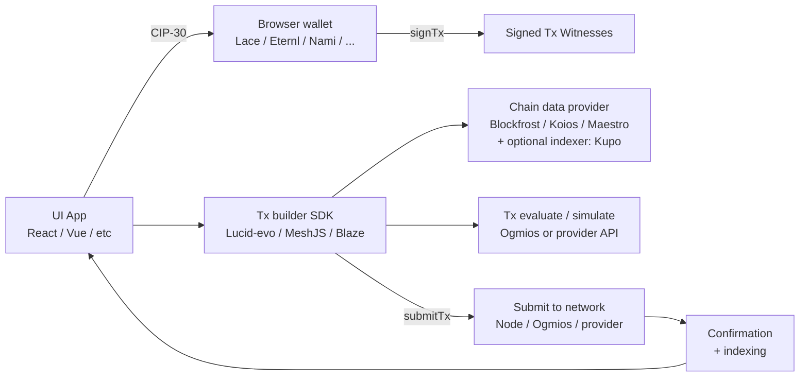
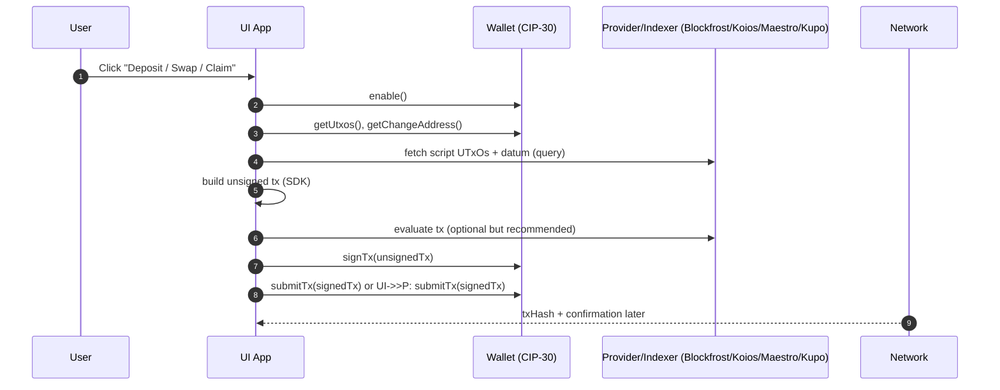
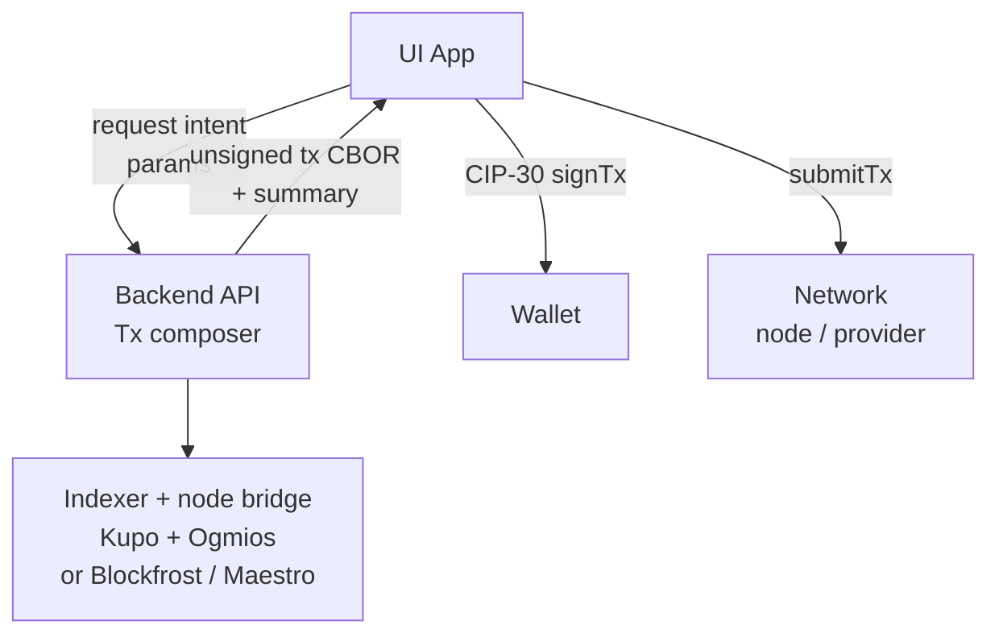
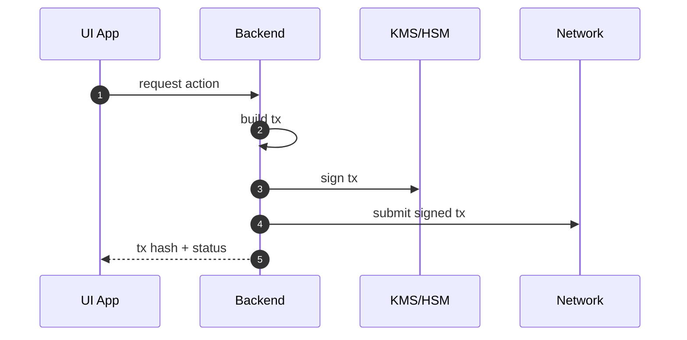

# Session 16: UI ↔ Smart Contracts (Wallets + Tx flow) - Notes

This guide explains **how a UI app interacts with Cardano smart contracts** (validators) in a production-style way, with clear architecture options, security notes, and diagrams.

## What “interacting with a smart contract” means on Cardano

On Cardano (eUTxO), “calling a contract” is **building a transaction** that:

- **Spends one or more UTxOs** (including script-locked UTxOs at a script address)
- **Provides redeemers + datums** as required by the validator
- **Satisfies script conditions** (signatures, time bounds, minting policies, etc.)
- **Pays fees / min-ADA** and produces new outputs

The validator runs during tx validation. Your UI (plus SDKs/services) does the *off-chain* work: selecting UTxOs, constructing outputs, attaching witnesses, then submitting.

---

## End-to-end flow (high-level)

**Key point**: the wallet usually **does not** “build” the tx. It signs and submits (depending on wallet capabilities). Your SDK + data provider handle most of the logic.

---

## Transaction lifecycle (practical checklist)

### 1) Connect wallet (CIP-30)
- Request access to wallet APIs (network id, addresses, UTxOs, collateral).
- Detect unsupported capabilities early (collateral, signData, etc.).

### 2) Fetch required on-chain state
- Wallet state: spendable UTxOs + change address.
- App state: script UTxOs to spend, reference scripts, datum/redeemer schema, token metadata.
- Optional: query by policy-id/asset, datum hash, script address via an indexer (Kupo) or provider.

### 3) Build the transaction
Common pieces:
- Inputs: user UTxOs + script UTxOs
- Outputs: updated script output (state machine), payments, change
- Mint/burn: attach minting policy scripts + redeemers (if needed)
- Validity interval: time bounds (important for “expiring” actions)
- Required signers: pubkey hashes that must sign
- Attachments: datums, redeemers, scripts or **reference scripts** (CIP-33)

### 4) Evaluate (recommended)
Before user signs, estimate:
- Execution units (CPU/mem)
- Fees
- Min-ADA for outputs

This is where Ogmios (or provider evaluation endpoints) helps you avoid “fails script” surprises.

### 5) Ask wallet to sign
- Wallet signs **only the required keys** (and sometimes all inputs depending on the wallet).
- UX: show the user what they’re signing (amounts, recipients, tokens).

### 6) Submit + confirm
- Submit via wallet or SDK/provider.
- Track tx hash until confirmed (or “failed” / “rolled back”).
- Update UI state (pending → confirmed), refresh UTxO/indexer views.

---

## Architecture options (recommended 2–3 ways)

Below are **three pro-level integration patterns**, ordered from most common to most specialized.

### Option A (recommended default): Client-built tx + wallet signing (CIP-30)

**Best for**: most dApps; simplest mental model; non-custodial.

- **Pros**: non-custodial, minimal backend, quick iteration, fewer infra concerns.
- **Cons**: heavier client logic; provider rate limits; complex indexer queries can be slow; secrets can’t live in browser (so you rely on public providers).

**Pro tips**
- Prefer **reference scripts** (CIP-33) and datum hashes where possible to reduce tx size.
- Add robust “pending” UX; handle mempool time + reorgs gracefully.
- Cache chain reads, debounce refreshes, and show clear error explanations (collateral missing, insufficient ADA for min-UTxO, invalid interval, etc.).

---

### Option B (recommended for production apps): Hybrid build — backend composes tx, wallet signs

**Best for**: complex protocols; better reliability; private provider keys; better indexing and caching; better protection against UI “logic drift”.

Pattern: the backend produces **an unsigned tx (CBOR)** or **a partially-constructed tx**, the wallet signs in the browser, then either client or server submits.

- **Pros**: backend centralizes protocol logic, supports caching, can choose best UTxO(s), can enforce invariants and “sanity checks”, can protect provider API keys.
- **Cons**: more infra; you must carefully design trust boundaries (UI should verify summary); still need wallet signing UX.

**Trust boundary guidance**
- The backend should return a **human-readable tx summary** (what the tx is intended to do) alongside CBOR.
- The UI should validate: network, recipients, amounts, policy IDs, and action parameters before prompting the user to sign.

---

### Option C (specialized): Server-side signing (custodial or delegated keys)

**Best for**: enterprise flows, custodial wallets, scheduled/automated operations, “agent” services.

- **Pros**: best automation; consistent submission; easier for non-crypto users.
- **Cons**: custody/security liability; regulatory/compliance implications; key management complexity; larger blast radius.

**If you do this**, treat it like a payments system: HSM/KMS, strict authZ, audit logs, rate limits, and incident response plans.

---

## Which SDK / tools to pick (practical)

You can mix-and-match, but pick one “lane” and standardize:

- **Frontend tx building**: MeshJS, Lucid-evo, Blaze (common choices in the ecosystem).
- **Node bridge (evaluation / submission)**: Ogmios (tx eval + submission), plus a real node behind it.
- **UTxO indexing**: Kupo (query script UTxOs and datum hashes efficiently).
- **Hosted provider APIs**: Blockfrost / Koios / Maestro (great for fast startup; mind rate limits).

---

## Common UI pitfalls (and how pros avoid them)

- **UTxO concurrency**: two users trying to spend the same script UTxO → one fails.
  - Mitigate via batching, “queue” patterns, or designing contracts that avoid single-UTxO hotspots.
- **Min-ADA surprises**: outputs holding tokens require enough ADA.
  - Compute min-UTxO in builder; show friendly error and “add ADA” suggestion.
- **Script size / fees**: attaching full scripts increases fees and can exceed limits.
  - Prefer reference scripts (CIP-33) and reference inputs.
- **Network mismatch**: user wallet on the wrong network (Preview/Preprod/Mainnet).
  - Hard block with a clear message + switch-network instructions.
- **Poor signing UX**: user can’t tell what they’re signing.
  - Display a concise summary: “Action, amounts, recipients, tokens, fees (est), validity”.

---

## Next steps

See the curated links in [Resources](../session-resources/readme.md). If you already have an Aiken validator repo, this session pairs well with creating a minimal off-chain “tx composer” and wiring it to a UI.

---

*These notes belong to the Q2 2026 Developer Experience Working Group.*

