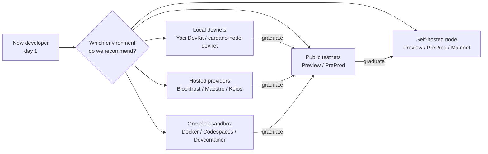
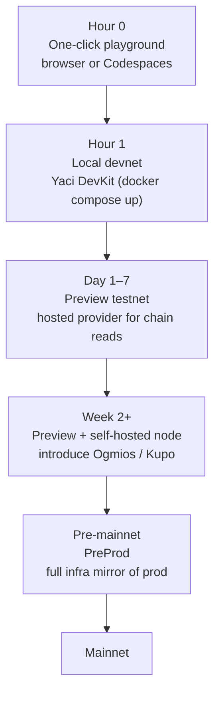

# Session 17: Default Developer Environment for Cardano - Notes

A working-group discussion on what the **default developer environment** on Cardano should be: what we recommend first to a developer who has never built on the chain before, and how the ecosystem can lower the cost of "day one."

> **Opening Question**
> *"If a new developer wanted to build on Cardano today, what environment should we recommend first by default?"*

Cardano currently offers many ways to build and test, but there is **no universally accepted "default path."** This session maps those options, weighs their trade-offs, and proposes a recommended flow for newcomers, intermediate builders, and production teams.

---

## Why this matters

The first 30 minutes a developer spends with Cardano shape whether they stay. Today a new builder is faced with a menu of choices (local devnet vs public testnet, self-hosted node vs hosted provider, container vs bare install) with no clear "start here" arrow. Each option is correct for *some* audience, but presenting all of them at once is the problem.

A good default environment should be:

- **Fast to start**: minutes, not hours
- **Realistic enough**: behaves like the network the dApp will eventually ship on
- **Reset-friendly**: easy to wipe and start over without losing courage
- **Path-forward**: graduating to production should not require throwing away what you learned

---

## Landscape at a glance

The arrows are the *real* question: **what should the path look like, end to end?**

---

## Core discussion areas

### 1) Local devnet vs public testnet

The first decision a builder faces.

| Aspect | Local devnet | Public testnet (Preview / PreProd) |
|---|---|---|
| Startup time | seconds | depends on node sync / faucet |
| Realism | low (one node, sometimes no protocol-accurate params) | high (real consensus, real timing) |
| Reset cost | trivial | painful (re-fund, re-deploy) |
| Offline work | yes | no |
| Collaboration | hard (everyone has their own chain) | easy (shared state) |
| CI friendliness | excellent | possible but slow + flaky |

**Questions for the room**

- Should developers start locally first, or jump straight to Preview/PreProd?
- What creates the **least friction** for the very first transaction?
- What gives the **most realistic experience** without overwhelming a newcomer?
- Is "realism" even useful before a developer can confidently build a tx?

---

### 2) Compare the main options

#### Local devnets (Yaci DevKit, cardano-node devnet)

**What works well**

- Fast iteration loop
- Full control of slot / epoch / time
- Offline / local development
- Easier reset between tests
- Great for CI and automated testing

**Where it falls short**

- Doesn't reflect real network conditions (mempool, propagation, fees under load)
- Additional setup complexity (Docker, ports, schemas)
- Possible parameter drift from public networks

**Best fit for**

- SDK development
- Validator / contract unit + integration testing
- Rapid prototyping
- CI pipelines

---

#### Public testnets: Preview / PreProd

**What works well**

- Real consensus, real block times, real fee market
- Closer to production behavior
- Shared ecosystem state (other devs' contracts you can interact with)
- Easier collaboration and demos

**Where it falls short**

- Faucet dependency (rate limits, downtime)
- Occasional network instability
- Slower feedback loop (epochs, propagation)
- Coordination complexity for teams

**Questions**

- Should **Preview** become the default for newcomers?
- Is **PreProd** too "late-stage" for first-day builders, or is its closer-to-mainnet parity worth the extra friction?

---

#### Hosted providers (Blockfrost, Maestro, Koios)

**What works well**

- Fast onboarding, no infra to manage
- Managed reliability and indexing
- Less operational burden on the developer
- Strong UX for newcomers

**Where it falls short**

- Centralization concerns
- Paid dependency past free tiers
- Abstracts infrastructure knowledge that becomes important later
- Rate limits can mask real-world tx behavior

**Discussion**

- Is managed infra **good for onboarding**, or does it create a knowledge gap that hurts developers later?
- Should learning node operations come **earlier** in the journey, or be deferred until it's actually needed?

---

#### Self-hosted nodes

**What works well**

- Maximum sovereignty
- Full network understanding (sync, peers, mempool, ledger)
- Production realism
- Aligned with Cardano's decentralization values

**Where it falls short**

- Heavy setup (sync time, disk, RAM)
- Ongoing maintenance burden
- Hardware / resource requirements

**Question**

- Should **running a node** still be considered a *core* Cardano developer skill, or is it now an SRE concern that most app developers can skip?

---

### 3) Dockerized / one-click environments

The interesting middle ground.

**Should Cardano provide an official:**

- Docker Compose setup?
- Dev container?
- One-click sandbox?
- Cloud workspace (GitHub Codespaces / Gitpod)?
- Preconfigured VSCode extension pack?

> *"Could Cardano reduce onboarding friction with a **one-command** developer environment?"*

**Candidate shapes**

- `docker compose up` → node + indexer + faucet + provider stub, ready in minutes
- Browser-based playground (no install, no wallet; write a tx, sign with a generated key, submit to a sandboxed devnet)
- GitHub Codespaces template: clone, click, code
- Preconfigured `.devcontainer/` shipped with starter templates

**Trade-offs to discuss**

- Who owns and maintains the official image? (Intersect? CF? community?)
- How do we keep parameters in sync with mainnet?
- Is "browser playground" too far from real workflows to be useful, or is it the *perfect* first ten minutes?

---

### 4) Recommended flow debate

The deliverable for this session: **propose a default path.** Below is a strawman to argue with, not a conclusion.

**Open questions**

- Is the playground step worth the maintenance cost, or do we send people straight to a local devnet?
- Where should **hosted provider vs self-hosted node** sit on the path?
- Should **Aiken + Mesh/Lucid/Blaze + Yaci DevKit + Preview** be branded as the "default stack", or is naming a stack overreach?
- What is the **single command** we want to be able to tell every new developer to run?

---

## Strawman recommendation

For the session to converge on something concrete, the proposal is:

1. **Default starting environment**: **Yaci DevKit** (local devnet via Docker). Run `docker compose up` and you have a node, faucet, and indexer.
2. **Default chain access for tutorials**: **Blockfrost free tier** on **Preview**. No faucet anxiety, no node sync, real consensus.
3. **Default SDK lane**: one of MeshJS / Lucid-evo / Blaze, picked per tutorial track but **not all three in one tutorial**.
4. **Graduation path**: introduce **Ogmios + Kupo + self-hosted node** *after* the developer has shipped their first working tx, not before.

This is a starting point for debate, not a decree. The point of the session is to **agree on a default** so the ecosystem can point newcomers at one path with confidence.

---

## Decisions to bring out of the session

- [ ] One canonical "default environment" recommendation (or a small matrix by audience)
- [ ] A position on whether Cardano should ship an official one-command dev environment
- [ ] Assignment of who maintains it (Intersect / CF / community working group)
- [ ] A documentation owner for keeping the recommendation current
- [ ] A follow-up session if scope expands (e.g. a deep dive on Yaci DevKit or a playground prototype)

---

## Related sessions

- [Session 14: SDK Repo Walkthrough](../../14-sdk-repo-walkthrough/session-notes/readme.md)
- [Session 15: dApp Architecture](../../15-dapp-architecture-demo/session-notes/readme.md)
- [Session 16: UI ↔ Smart Contracts](../../16-ui-smart-contract-interaction/session-notes/readme.md)

See the curated links in [Resources](../session-resources/readme.md).

---

*These notes belong to the Q2 2026 Developer Experience Working Group.*
