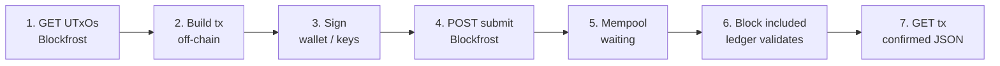
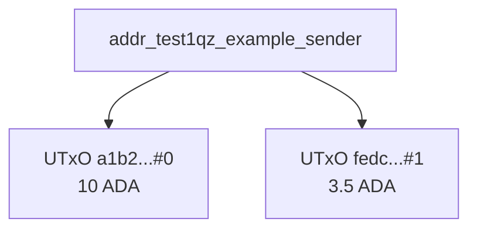
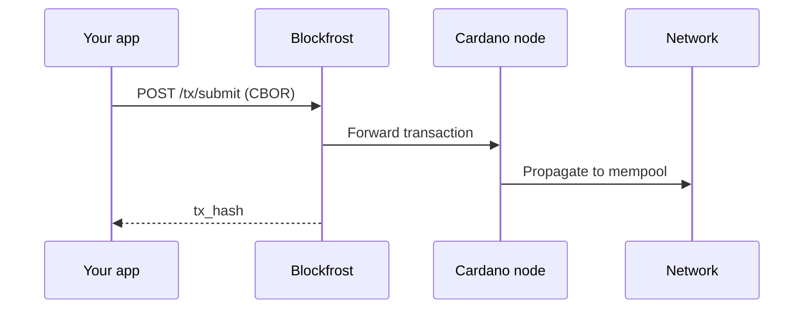
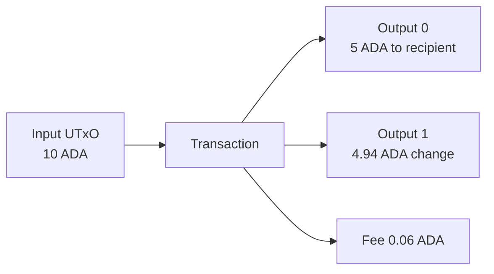
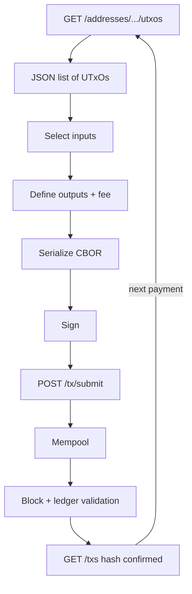

# Session 19: One API Call to Understand Cardano

Cardano uses **UTxOs** (Unspent Transaction Outputs): discrete coins sitting at addresses. It does **not** store a single "account balance" like many other chains. One Blockfrost API call returns those coins as JSON, and that is enough to understand how value moves on Cardano.

This session walks through **dummy JSON** for each step of sending ADA on **Preview testnet**: read coins, build a transaction, sign, submit, and confirm on chain.

> **One sentence summary**
> *Fetch UTxOs, build and sign a transaction off-chain, submit it, then read the same data back from Blockfrost as the chain confirms.*

---

## Who this is for

- Backend or API developers new to Cardano
- Anyone who understands REST/JSON but not yet eUTxO
- Builders who will later use Mesh, Blaze, or Lucid (this session shows what those SDKs wrap under the hood)

**You need:** a Blockfrost Preview project ID (free tier is fine). No Haskell. No node sync.

---

## Key ideas before we start

| Term | Plain explanation |
|------|-------------------|
| **UTxO** | A coin (or token bundle) created by a past transaction and not yet spent. Identified by `tx_hash` + `output_index`. |
| **Lovelace** | Smallest unit of ADA. 1 ADA = 1,000,000 lovelace. Blockfrost returns amounts in lovelace as strings. |
| **Blockfrost** | A hosted API that reads chain data and forwards transactions to a node. It is **not** the blockchain itself. |
| **Off-chain** | Building and signing happen on your machine or in your app. Only the final signed bytes go to the network. |
| **Mempool** | A waiting area where submitted transactions sit until a block producer includes them in a block. |
| **CBOR** | Binary format Cardano uses for transactions on the wire. Blockfrost submit expects CBOR bytes, not JSON. |

**Account model vs eUTxO (why this matters):**

On an account-based chain, you might see `"balance": "13.5"`. On Cardano, you see **two separate UTxOs** (10 ADA and 3.5 ADA). To pay someone, you **consume** whole UTxOs as inputs and **create** new UTxOs as outputs (payment + change). That difference drives every API response in this session.

---

## The full on-chain flow (overview)

When a user clicks "Send" in a wallet, seven things happen in order. Blockfrost helps with steps 1, 4, and 7; the rest is your app, wallet, and the Cardano network.



| Step | What happens | Who does it | Blockfrost? |
|------|--------------|-------------|-------------|
| 1. Read UTxOs | List spendable coins at an address | Your app | Yes: `GET /addresses/{address}/utxos` |
| 2. Build | Pick inputs, outputs, fee, change | Your app or SDK | No |
| 3. Sign | Prove you own the inputs | Wallet or local keys | No |
| 4. Submit | Broadcast signed tx to the network | Your app via Blockfrost | Yes: `POST /tx/submit` |
| 5. Mempool | Tx waits to be picked into a block | Cardano nodes | No (automatic) |
| 6. Validate | Every node checks ledger rules | Cardano network | No (automatic) |
| 7. Confirm | Read tx status and new UTxOs | Your app | Yes: `GET /txs/{hash}` |

**Why poll in step 7?** Submit returns a hash immediately, but inclusion in a block takes time (often seconds on Preview). Until `block` is set in the JSON, the payment is pending, not final.

---

## Step 1: One API call to see how Cardano holds value

### What you are doing

You ask Blockfrost: *"What unspent outputs exist at this address right now?"* The answer is an array. Each item is one spendable coin.

### Why not a balance endpoint?

Cardano nodes track **individual outputs**, not running balances. Indexers like Blockfrost aggregate those outputs per address for convenience, but the underlying model is always a list of UTxOs. Wallets and SDKs sum lovelace when they need a total.

### Request (Preview testnet)

```http
GET https://cardano-preview.blockfrost.io/api/v0/addresses/addr_test1qz_example_sender/utxos
project_id: previewYourProjectId
```

- **`cardano-preview.blockfrost.io`**: Preview testnet only. Mainnet uses a different base URL and project ID.
- **`project_id` header**: Your API key from the Blockfrost dashboard.

### Dummy response (simplified)

```json
[
  {
    "tx_hash": "a1b2c3d4e5f6789012345678901234567890abcdef1234567890abcdef123456",
    "output_index": 0,
    "amount": [
      { "unit": "lovelace", "quantity": "10000000" }
    ],
    "address": "addr_test1qz_example_sender",
    "data_hash": null
  },
  {
    "tx_hash": "fedcba0987654321fedcba0987654321fedcba0987654321fedcba0987654321",
    "output_index": 1,
    "amount": [
      { "unit": "lovelace", "quantity": "3500000" }
    ],
    "address": "addr_test1qz_example_sender",
    "data_hash": null
  }
]
```

### Field-by-field explanation

| Field | Meaning |
|-------|---------|
| `tx_hash` | Transaction that originally created this output |
| `output_index` | Position of this output inside that transaction (0, 1, 2, ...) |
| `tx_hash` + `output_index` | Together they uniquely identify one UTxO (often written `txHash#0`) |
| `quantity` | Lovelace amount as a string (avoids JSON integer limits) |
| `unit: lovelace` | Native ADA. Other units would be native assets or NFT policy IDs |
| `address` | Who can spend this output (must sign the spending transaction) |
| `data_hash` | Link to datum for smart contracts; `null` for simple ADA transfers |

**Total spendable:** `10_000_000 + 3_500_000 = 13_500_000` lovelace = **13.5 ADA**.



Think of the address as a **wallet pocket** holding separate bills (UTxOs), not one pooled number. When you pay someone, you pick which bills to use as inputs.

---

## Step 2: Build the transaction (off-chain)

### What you are doing

You construct a transaction that says: *"Spend these input UTxOs, create these new outputs, pay this fee."* This happens entirely off-chain. Blockfrost is not involved yet.

### Why inputs and outputs?

Cardano cannot "deduct 5 ADA from a balance." It must **destroy** one or more existing UTxOs (inputs) and **mint** new UTxOs (outputs). If inputs total more than outputs plus fee, the leftover goes back to you as **change** (a new UTxO at your address).

### Dummy logical structure (not sent to Blockfrost as JSON)

```json
{
  "inputs": [
    {
      "tx_hash": "a1b2c3d4e5f6789012345678901234567890abcdef1234567890abcdef123456",
      "output_index": 0
    }
  ],
  "outputs": [
    {
      "address": "addr_test1qp_example_recipient",
      "amount": [{ "unit": "lovelace", "quantity": "5000000" }]
    },
    {
      "address": "addr_test1qz_example_sender",
      "amount": [{ "unit": "lovelace", "quantity": "4940000" }]
    }
  ],
  "fee": "60000"
}
```

| Part | Purpose |
|------|---------|
| **Input** (10 ADA UTxO) | The coin you spend |
| **Output 1** (5 ADA to recipient) | The payment |
| **Output 2** (~4.94 ADA change) | Leftover back to sender |
| **Fee** (60,000 lovelace) | Paid to the network; not sent to any user address |

**Balance check:** input = outputs + fee → `10_000_000 = 5_000_000 + 4_940_000 + 60_000`.

### What happens next (still off-chain)

1. Your SDK serializes the transaction body to **CBOR** (compact binary).
2. Signatures (**witnesses**) are attached proving you control the input addresses.
3. The result is **signed CBOR hex** ready for submit.

You never POST the JSON above to Blockfrost. Only the signed CBOR bytes go to `/tx/submit`.

---

## Step 3: Sign (wallet)

### What you are doing

Signing proves ownership of the private keys for the input addresses. Without valid signatures, nodes reject the transaction during ledger validation.

### Why Blockfrost is not involved

Private keys must stay in the wallet (or secure enclave). Blockfrost never sees your keys; it only receives an already-signed transaction.

### Typical flow

1. Your app passes the unsigned transaction to the wallet (CIP-30 in browsers).
2. The wallet shows the user: *"Send 5 ADA to addr_test1qp..."*
3. The user approves.
4. The wallet returns **signed CBOR hex**.

**Dummy signed transaction (CBOR hex, truncated):**

```
84a40081825820a1b2c3d4e5f6789012345678901234567890abcdef1234567890abcdef12345600018282583901...
```

The hex looks opaque; that is normal. Explorers and APIs decode it into inputs, outputs, and metadata after it is on chain.

---

## Step 4: Submit to the chain via Blockfrost

### What you are doing

You broadcast the signed transaction to the Cardano network. Blockfrost accepts your CBOR and forwards it to a connected node, which puts it in the **mempool**.

### Request

```http
POST https://cardano-preview.blockfrost.io/api/v0/tx/submit
project_id: previewYourProjectId
Content-Type: application/cbor
```

- **Body:** raw signed CBOR bytes (binary), not JSON.
- **Success:** you get back the transaction hash (tx id).

### Dummy success response

```json
"a1b2c3d4e5f6789012345678901234567890abcdef1234567890abcdef123456"
```

**What this means:**

- The network **accepted** your transaction into the mempool.
- It is **not confirmed yet**. A block producer must include it in a block, and all nodes must validate it.
- Save this hash; you use it to poll status and show users a link on an explorer.



If submit fails, common causes are malformed CBOR, wrong network, or a transaction that would fail ledger rules (fix the build step before retrying).

---

## Step 5: Poll until confirmed

### What you are doing

You repeatedly call `GET /txs/{hash}` until the transaction appears in a block. This is how apps show "Pending..." then "Confirmed."

### Request

```http
GET https://cardano-preview.blockfrost.io/api/v0/txs/a1b2c3d4e5f6789012345678901234567890abcdef1234567890abcdef123456
project_id: previewYourProjectId
```

### Dummy response (pending)

```json
{
  "hash": "a1b2c3d4e5f6789012345678901234567890abcdef1234567890abcdef123456",
  "block": null,
  "block_height": null,
  "block_time": null,
  "slot": null,
  "index": null,
  "output_amount": [
    { "unit": "lovelace", "quantity": "9940000" }
  ],
  "fees": "60000",
  "valid_contract": true
}
```

**How to read pending:**

| Field | Pending value | Explanation |
|-------|---------------|-------------|
| `block` | `null` | Not in any block yet. Still in mempool or propagating. |
| `block_height` | `null` | No depth on chain until a block exists. |
| `fees` | `"60000"` | Fee is already fixed in the signed tx. |
| `valid_contract` | `true` | Does not mean confirmed; check `block` instead. |

**Do not treat pending as final.** Wait until `block` is a non-null hash.

### Dummy response (confirmed)

```json
{
  "hash": "a1b2c3d4e5f6789012345678901234567890abcdef1234567890abcdef123456",
  "block": "9f8e7d6c5b4a3210fedcba0987654321fedcba0987654321fedcba0987654321",
  "block_height": 1234567,
  "block_time": 1719403200,
  "slot": 98765432,
  "index": 4,
  "output_amount": [
    { "unit": "lovelace", "quantity": "9940000" }
  ],
  "fees": "60000",
  "valid_contract": true
}
```

**How to read confirmed:**

| Field | Explanation |
|-------|-------------|
| `block` | Hash of the block containing this transaction |
| `block_height` | Block number; confirmations = latest height minus this height |
| `block_time` | Unix timestamp when the block was created |
| `index` | Position of this tx inside the block |
| `valid_contract` | Ledger validation passed |

**Practical polling:** call every 2 to 5 seconds on Preview until `block` is set, or use websocket/webhook patterns in production apps.

---

## Step 6: See inputs and outputs (UTxO graph)

### What you are doing

After confirmation, you inspect **which UTxOs were consumed** and **which new UTxOs were created**. This is the on-chain proof of the payment.

### Request

```http
GET https://cardano-preview.blockfrost.io/api/v0/txs/a1b2c3.../utxos
project_id: previewYourProjectId
```

### Dummy response (simplified)

```json
{
  "hash": "a1b2c3d4e5f6789012345678901234567890abcdef1234567890abcdef123456",
  "inputs": [
    {
      "address": "addr_test1qz_example_sender",
      "amount": [{ "unit": "lovelace", "quantity": "10000000" }],
      "tx_hash": "old_tx_hash_spent_here",
      "output_index": 0
    }
  ],
  "outputs": [
    {
      "address": "addr_test1qp_example_recipient",
      "amount": [{ "unit": "lovelace", "quantity": "5000000" }],
      "output_index": 0
    },
    {
      "address": "addr_test1qz_example_sender",
      "amount": [{ "unit": "lovelace", "quantity": "4940000" }],
      "output_index": 1
    }
  ]
}
```

### What changed on chain

| Before | After |
|--------|-------|
| Input UTxO (10 ADA) existed | Input UTxO is **spent** (gone forever) |
| Recipient had no UTxO from this payment | New UTxO (5 ADA) at recipient address |
| Sender had two UTxOs | Sender now has change UTxO (4.94 ADA) plus the unspent 3.5 ADA UTxO from step 1 |



The recipient can now call `GET /utxos` on their address and see the new 5 ADA coin. That is how Cardano "moves" value: old outputs destroyed, new outputs created.

---

## End-to-end schema (Blockfrost + network)

**Phase 1: Read** (what coins exist) → **Phase 2: Build** (off-chain assembly) → **Phase 3: Write** (submit and confirm on chain)



| Phase | Blockfrost role | Network role |
|-------|-----------------|--------------|
| **Read** | Returns indexed UTxO list | State already on chain |
| **Build / Sign** | None | None (local only) |
| **Write** | Forwards submit; returns tx hash | Mempool, block production, ledger rules |

After confirmation, the next payment starts again at **Read** with updated UTxOs.

---

## Try it yourself (session checklist)

- [ ] Create a free Blockfrost **Preview** project at [blockfrost.io](https://blockfrost.io)
- [ ] Fund a test address from the [Preview faucet](https://docs.cardano.org/cardano-testnets/tools/faucet)
- [ ] Call `GET /addresses/{address}/utxos` and sum lovelace manually
- [ ] Send a small amount with a wallet (Eternl, Lace, or Nami on Preview)
- [ ] Poll `GET /txs/{hash}` until `block` is not null
- [ ] Call `GET /txs/{hash}/utxos` and verify inputs match outputs plus fee

Optional read-only `curl` (replace placeholders):

```bash
curl -s \
  -H "project_id: previewYourProjectId" \
  "https://cardano-preview.blockfrost.io/api/v0/addresses/addr_test1YOUR_ADDRESS/utxos" \
  | jq .
```

---

## Common mistakes (and how to fix them)

| Mistake | What you see | Fix |
|---------|--------------|-----|
| Mainnet project ID with Preview address | Empty UTxOs or 404 | Match network: Preview ID + Preview URL |
| Spending the same UTxO twice | Second submit fails | Re-fetch UTxOs after each confirmed tx |
| Output below min-ADA | Build or submit error | Increase output lovelace (protocol minimum) |
| Treating `block: null` as failure | Premature error UI | Poll until `block` is set |
| Expecting a balance field in JSON | Confusion about totals | Sum UTxO `quantity` values yourself |
| POSTing JSON to `/tx/submit` | 400 error | Send signed CBOR bytes with `Content-Type: application/cbor` |

---

## Session outcomes

After this session you should be able to:

- [ ] Explain why Cardano returns a **list of UTxOs**, not one balance
- [ ] Name the Blockfrost calls for **read**, **submit**, and **confirm**
- [ ] Trace a payment from **GET utxos** to **confirmed tx JSON**
- [ ] Describe what happens on chain between submit and `block` being set
- [ ] Read dummy JSON and identify **inputs**, **outputs**, **change**, and **fee**

---

## What comes next

- **Session 16**: wallets, SDKs, and smart contract interactions (automates steps 2 to 4)
- **SDK path**: Mesh, Blaze, or Lucid wrap Blockfrost and transaction building
- **Core path**: [Cardano Blueprint](https://cardano-scaling.github.io/cardano-blueprint/introduction/index.html) for the ledger rules that validate every transaction

---

*These notes belong to the Q2 2026 Developer Experience Working Group. Led by Dan Baruka, Developer Advocate.*
